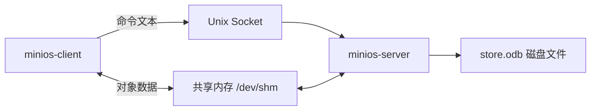
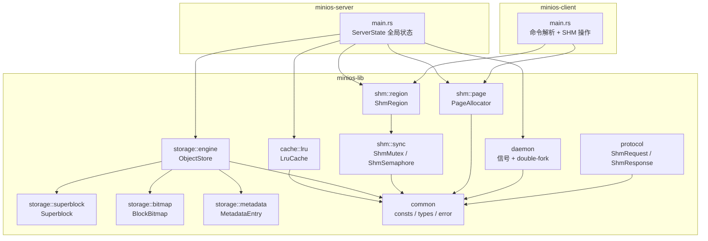
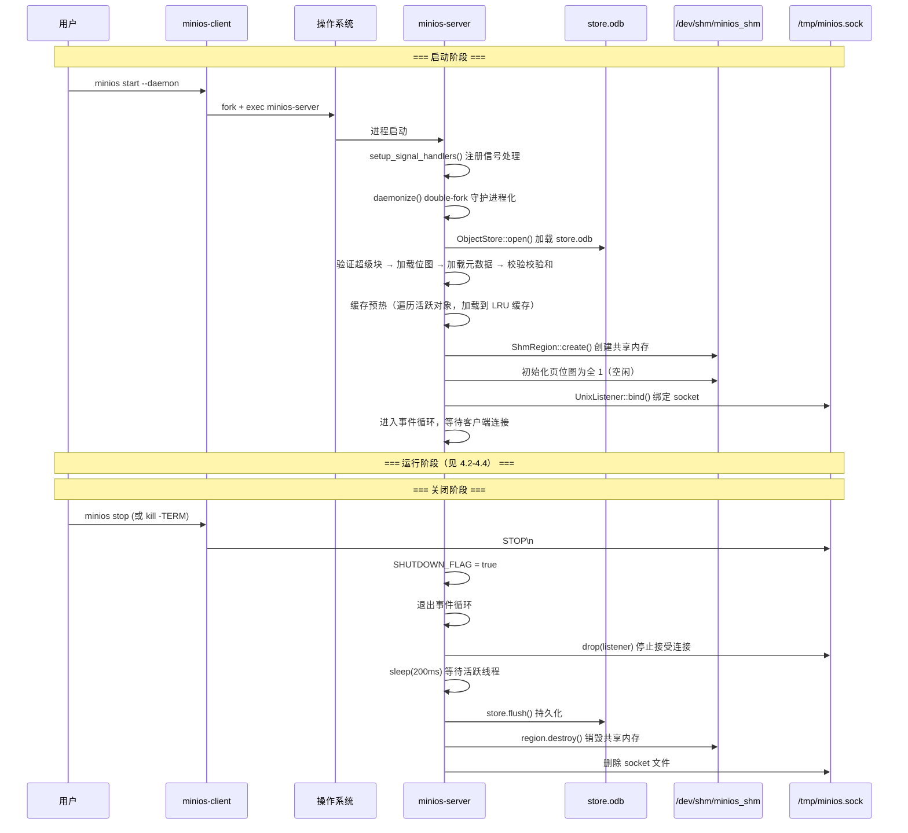
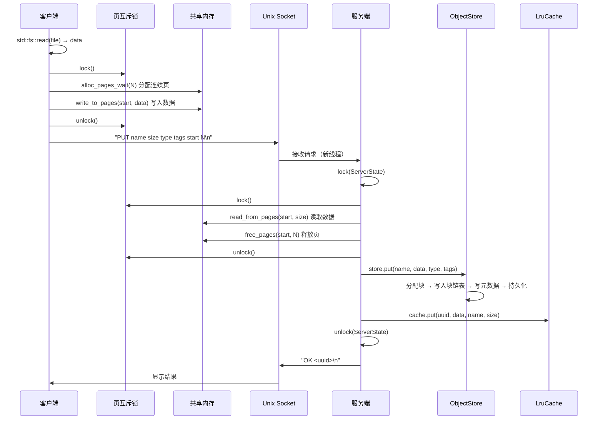
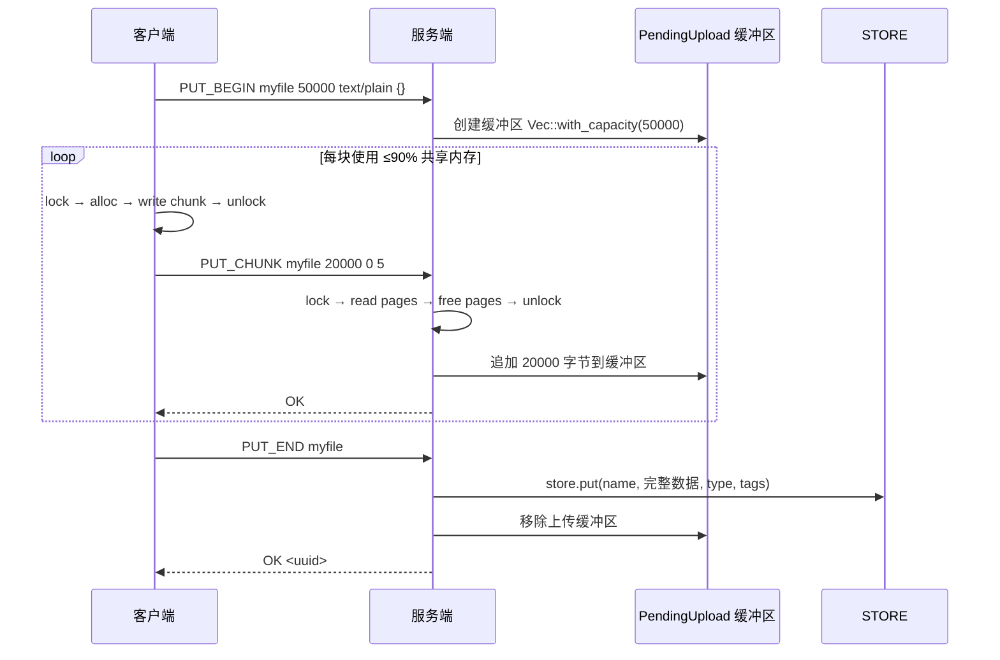
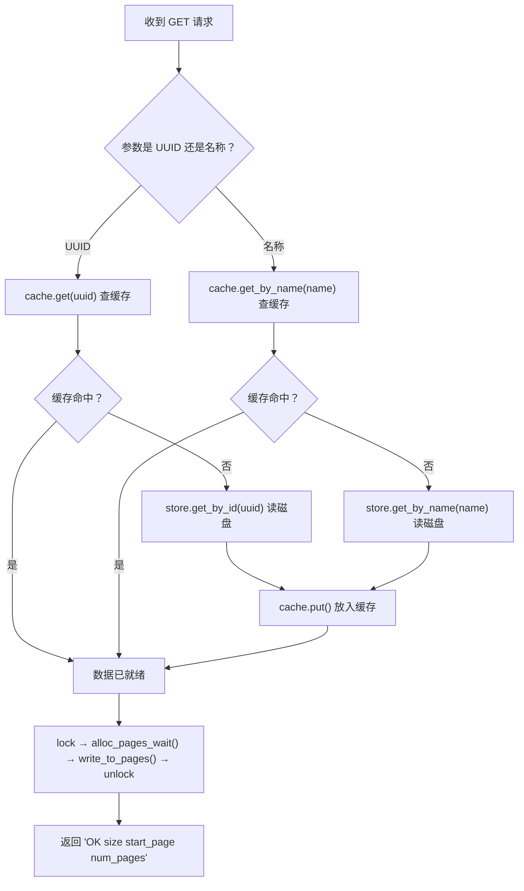
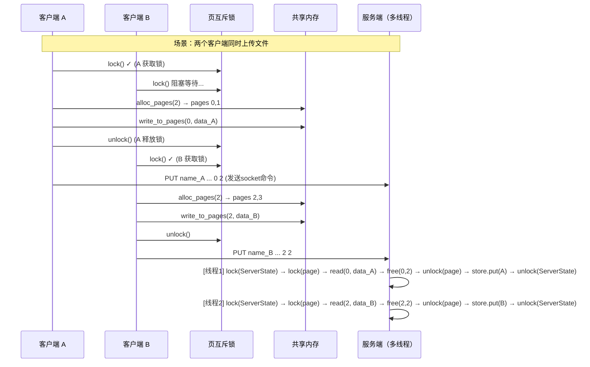

# MiniOS 系统架构详解

> 面向操作系统原理和 Rust 语言的初学者

本文档深入解析 MiniOS 对象存储系统的内部设计，从单个模块的数据结构出发，逐步揭示模块间的协作方式，最终展现整个系统的运行全景。

---

## 目录

1. [项目概览](#1-项目概览)
2. [第一部分：每个模块的内部逻辑](#2-第一部分每个模块的内部逻辑)
   - [2.1 common — 公共基础模块](#21-common--公共基础模块)
   - [2.2 storage — 持久化存储引擎](#22-storage--持久化存储引擎)
   - [2.3 shm — 共享内存管理](#23-shm--共享内存管理)
   - [2.4 cache — LRU 缓存](#24-cache--lru-缓存)
   - [2.5 protocol — 通信协议](#25-protocol--通信协议)
   - [2.6 daemon — 守护进程](#26-daemon--守护进程)
3. [第二部分：模块间如何建立联系](#3-第二部分模块间如何建立联系)
4. [第三部分：整个系统如何工作](#4-第三部分整个系统如何工作)
5. [第四部分：关键代码详细讲解](#5-第四部分关键代码详细讲解)

---

## 1. 项目概览

MiniOS 是一个**简单的对象存储系统**，类似于一个迷你版的 AWS S3 或 MinIO。它的核心思想非常简单：

> 用户通过命令行将文件上传到服务端，服务端将文件持久化到磁盘上的单一文件 `store.odb` 中。需要时，用户可以通过 UUID 或文件名将文件取回。

系统由三个 Rust crate 组成（Cargo workspace）：

```
MiniOS/
├── minios-lib/       # 核心库：存储引擎、共享内存、缓存、协议等
├── minios-server/     # 服务端二进制：守护进程，监听 socket 请求
└── minios-client/     # 客户端二进制：命令行工具，发送请求
```

**通信方式**：服务端和客户端通过两条通道通信：

| 通道 | 技术 | 用途 |
|------|------|------|
| 控制通道 | Unix Domain Socket | 发送命令文本（PUT/GET/DELETE/LIST/STATUS/STOP） |
| 数据通道 | POSIX 共享内存（`shm_open` + `mmap`） | 传输对象数据（文件内容） |



---

## 2. 第一部分：每个模块的内部逻辑

`minios-lib` 核心库包含 6 个子模块，自底向上分别是：

### 2.1 common — 公共基础模块

**文件位置**：`minios-lib/src/common/`

这是最底层的模块，所有其他模块都依赖它。它定义了整个系统共享的"词汇表"。

#### consts.rs — 全局常量

```rust
// 文件格式魔数（Magic Number），用于识别文件类型
pub const STORE_MAGIC: [u8; 4] = *b"MOSB";  // store.odb 的前 4 字节
pub const SHM_MAGIC: [u8; 4] = *b"MOSM";    // 共享内存控制头的前 4 字节

// 核心大小常量
pub const BLOCK_SIZE: u64 = 4096;            // 每个数据块 4KB
pub const BLOCK_PAYLOAD: usize = 4088;        // 每块有效载荷 = 4096 - 8（next指针）
pub const METADATA_ENTRY_SIZE: u64 = 256;    // 每个元数据条目 256 字节
pub const SHM_PAGE_SIZE: u32 = 4096;         // 共享内存每页 4KB

// 链表结束标记
pub const BLOCK_CHAIN_END: u64 = u64::MAX;   // 用 u64 最大值表示链表末尾
```

**为什么 `BLOCK_PAYLOAD = 4088`？** 因为每个 4096 字节的数据块最后 8 个字节被预留为"下一块指针"（`next_ptr`），所以实际能存数据的是 4088 字节。这和操作系统中链表文件分配（linked allocation）的原理一致。

#### types.rs — 核心类型

```rust
pub type ObjectId = [u8; 16];  // UUID v4，16字节的唯一标识符

// list() 返回的对象摘要（不含数据）
pub struct ObjectSummary {
    pub uuid: ObjectId,
    pub name: String,
    pub size: u64,
    pub content_type: String,
    pub created_at: i64,
    pub tags: String,
    pub block_count: u32,
}

// get() 返回的完整对象（摘要 + 数据）
pub struct ObjectData {
    pub summary: ObjectSummary,
    pub data: Vec<u8>,
}

// 各类统计信息
pub struct StoreStats { /* 存储引擎统计 */ }
pub struct CacheStats { /* 缓存统计 */ }
```

#### error.rs — 错误类型

使用 `thiserror` crate 定义了统一的错误枚举 `MiniosError`，包含 11 种错误变体：`Io`（磁盘 I/O）、`InvalidStore`（文件损坏）、`ObjectNotFound`、`NoSpace`（空间不足）、`ShmError`（共享内存错误）等。

---

### 2.2 storage — 持久化存储引擎

**文件位置**：`minios-lib/src/storage/`

这是整个系统最核心的模块，负责将对象数据持久化到磁盘文件 `store.odb` 中。它由四个子模块组成，从上到下依次是：

```
engine.rs        ← 对外接口层（ObjectStore）
  ├── superblock.rs  ← 文件头（全局元信息）
  ├── bitmap.rs      ← 位图（管理数据块的空闲/占用状态）
  └── metadata.rs    ← 元数据条目（每个对象一条）
```

#### 2.2.1 superblock.rs — 超级块

**类比**：超级块就像一本书的**目录页**——它告诉你每一章从哪里开始、有多少页。

`store.odb` 文件的前 4096 字节是超级块，存储了文件全局布局信息：

```
文件偏移    内容
0..4096     Superblock（超级块）
4096..?     Metadata Area（元数据区）
?..?        Free Block Bitmap（空闲块位图）
?..EOF      Data Block Area（数据块区）
```

超级块的关键字段（`Superblock` 结构体）：

| 字段 | 说明 | 示例值 |
|------|------|--------|
| `magic` | 魔数，固定 `MOSB` | `[b'M', b'O', b'S', b'B']` |
| `version` | 格式版本 | 1 |
| `total_objects` | 活跃对象总数 | 42 |
| `metadata_area_offset` | 元数据区起始偏移 | 4096 |
| `data_area_offset` | 数据区起始偏移 | 计算得出 |
| `data_area_total_blocks` | 数据块总数 | 4096 |
| `data_area_free_blocks` | 空闲块数 | 4000 |
| `created_at` / `last_modified` | 时间戳 | Unix 秒 |

超级块使用**手写的小端序序列化**（`serialize()` / `deserialize()` 方法），逐字段按偏移量写入 4096 字节缓冲区。验证时（`validate()`）检查魔数、版本号、以及各区偏移量的一致性。

#### 2.2.2 bitmap.rs — 空闲块位图

**类比**：位图就像停车场的**车位指示灯**——红色表示已占用，绿色表示空闲。

每个数据块在位图中对应一个 bit：
- **1 = 空闲**（可以分配）
- **0 = 已占用**（有人在使用）

位图内部使用 `Vec<u64>` 存储，每个 `u64`（64 位）管理 64 个数据块的状态。例如 `bits[0]` 管理块 0-63，`bits[1]` 管理块 64-127。

**分配算法**：使用 CPU 指令 `trailing_zeros()` 进行快速扫描。这个指令可以一次找到 u64 中最低位的 1 的位置：

```rust
pub fn allocate_one(&mut self) -> Option<u64> {
    for (word_idx, word) in self.bits.iter_mut().enumerate() {
        if *word != 0 {                           // 这个字里还有空闲块
            let bit_idx = word.trailing_zeros() as usize;  // 找到第一个空闲位
            *word &= !(1u64 << bit_idx);           // 标记为占用（0）
            self.free_blocks -= 1;
            return Some((word_idx * 64 + bit_idx) as u64);
        }
    }
    None  // 没有空闲块了
}
```

**重要特性**：数据块**不需要连续分配**。每个数据块末尾有 8 字节的 `next` 指针，可以像链表一样串联起来。所以位图只需要找到任意空闲块，不需要找连续的空闲块。

#### 2.2.3 metadata.rs — 元数据条目

**类比**：元数据条目就像图书馆里的**索引卡片**——每张卡片记录了一本书的位置、大小等信息。

每个对象在元数据区占据一条 256 字节的记录。字段布局如下：

```
偏移     大小    字段           说明
0..16    16 B    uuid           对象唯一标识符
16..80   64 B    name           对象名称（最长 63 字符 + null）
80..88    8 B    size           对象数据总大小
88..120  32 B    content_type   内容类型（MIME）
120..128  8 B    created_at     创建时间戳
128..192 64 B    tags           自定义标签（JSON）
192..200  8 B    block_ptr_head 数据块链表的第一个块索引
200..204  4 B    block_count    占用的数据块数
204       1 B    flags          状态标志（0=空闲, 1=活跃, 2=已删除）
205       1 B    checksum       XOR 校验和（前 205 字节）
206..256 50 B    _reserved      保留
```

关键概念——**三种状态**：

```rust
pub mod flags {
    pub const FREE: u8 = 0x00;       // 空闲槽位，可以被新对象使用
    pub const ACTIVE: u8 = 0x01;     // 活跃对象，存储着有效数据
    pub const TOMBSTONE: u8 = 0x02;  // 已删除（墓碑），槽位可复用
}
```

**为什么用"墓碑"而不是直接清零？** 这是为了在崩溃恢复时能区分"从未使用过"和"曾经使用过但已删除"两种状态。同时，删除操作只需修改 1 字节的 flags，比清空整个 256 字节快得多。

**校验和机制**：`checksum` 字段是前 205 字节的 XOR 累加结果。服务端启动时扫描所有活跃条目，如果发现校验和不匹配，说明磁盘数据已损坏，拒绝打开文件。

```rust
pub fn update_checksum(&mut self) {
    let bytes = self.to_bytes();
    let checksum = bytes[0..205].iter().fold(0u8, |acc, &b| acc ^ b);
    self.checksum = checksum;
}
```

#### 2.2.4 engine.rs — 对象存储引擎

**类比**：存储引擎就是图书馆的**管理员**——它知道怎么存书、怎么找书、怎么处理借阅归还。

`ObjectStore` 是整个 storage 模块的**门面（Facade）**，对外提供四个核心操作：

```rust
pub struct ObjectStore {
    file: File,                          // store.odb 文件句柄
    superblock: Superblock,              // 超级块
    bitmap: BlockBitmap,                 // 位图
    metadata_cache: Vec<MetadataEntry>,  // 元数据缓存（全部在内存中）
}
```

**启动时**，元数据区被全部加载到 `metadata_cache: Vec<MetadataEntry>` 中。这意味着：
- 查找对象时是 **O(n) 线性扫描**（n = 最大对象数，默认 1024）
- 不需要 B-Tree 等复杂索引结构
- 作为课程设计项目，这个简化是合理的

**关键操作流程**：

`put()` —— 存储一个对象：
1. 在 `metadata_cache` 中找一个空闲槽位
2. 在 `bitmap` 中分配数据块
3. 将数据按 4088 字节分块，逐块写入，每块末尾写 next 指针
4. 生成 UUID，创建 `MetadataEntry`，计算校验和
5. 更新超级块，持久化位图和超级块到磁盘

`get_by_id()` / `get_by_name()` —— 读取对象：
1. 线性扫描 `metadata_cache` 找到匹配的条目
2. 从 `block_ptr_head` 开始遍历块链表
3. 逐块读取 payload，拼接成完整数据

`delete()` —— 删除对象：
1. 遍历块链表，释放所有数据块（`bitmap.free_blocks()`）
2. 标记元数据条目为 `TOMBSTONE`
3. 更新超级块统计

`list()` —— 列出所有对象：过滤 `flags == ACTIVE` 的条目并返回摘要。

---

### 2.3 shm — 共享内存管理

**文件位置**：`minios-lib/src/shm/`

**为什么需要共享内存？** 

如果通过 Unix Socket 传输文件数据，数据需要在客户端内存 → socket 缓冲区 → 服务端内存之间多次拷贝。对于几 MB 的大文件，这种拷贝开销非常可观。

共享内存让客户端和服务端**直接访问同一块物理内存页**，数据只需写入一次，对方就能读取，实现了零拷贝（zero-copy）传输。

#### 2.3.1 sync.rs — 跨进程同步原语

共享内存在带来性能优势的同时，也引入了经典的**并发控制**问题：如果客户端正在写入数据的同时服务端在读取，就会读到不完整的数据。

MiniOS 使用两种 POSIX 同步机制解决这个问题：

**（1）`ShmMutex` — 跨进程互斥锁**

将 `pthread_mutex_t` 放置在共享内存的控制页中，并设置 `PTHREAD_PROCESS_SHARED` 属性，使其可以被多个进程共享：

```rust
pub unsafe fn init_at(ptr: *mut u8) -> MiniosResult<Self> {
    let mutex_ptr = ptr as *mut libc::pthread_mutex_t;
    let mut attr: libc::pthread_mutexattr_t = unsafe { std::mem::zeroed() };
    libc::pthread_mutexattr_init(&mut attr);
    // 关键步骤：设置跨进程共享属性
    libc::pthread_mutexattr_setpshared(&mut attr, libc::PTHREAD_PROCESS_SHARED);
    libc::pthread_mutex_init(mutex_ptr, &attr);
    // ...
}
```

**（2）`ShmSemaphore` — 命名 POSIX 信号量**

封装了 `sem_open` / `sem_wait` / `sem_post` 系列操作。当前协议中信号量已定义但尚未接入主流程——实际同步通过页互斥锁完成。

#### 2.3.2 region.rs — 共享内存区域

**类比**：`ShmRegion` 就是一块**共享白板**——服务端创建它，客户端连接它，双方都可以在上面写写画画。

共享内存区域布局：

```
Page 0 (控制页, 4096 B):
├── ShmControlHeader      (~32 B)   魔数, 版本, 总页数, 空闲页数...
├── Page Bitmap           (变长)    页分配位图 (1=空闲, 0=占用)
├── pthread_mutex_t       (~40 B)   跨进程页分配锁
└── (保留空间)

Page 1..N (数据页, 每页 4096 B):
├── 用于传输对象数据
```

**创建流程**（`ShmRegion::create()`）：

```rust
// 1. 创建 POSIX 共享内存对象
let shm_fd = shm_open(name, O_CREAT | O_RDWR, 0o600);

// 2. 设置大小
ftruncate(shm_fd, region_size);

// 3. 映射到当前进程地址空间
let ptr = mmap(NULL, region_size, PROT_READ | PROT_WRITE, MAP_SHARED, shm_fd, 0);

// 4. 初始化控制头和互斥锁
write(ptr, ShmControlHeader { magic: b"MOSM", ... });
ShmMutex::init_at(ptr + mutex_offset);
```

**打开流程**（`ShmRegion::open()`）：
客户端使用 `shm_open` + `mmap` 打开已存在的共享内存，**但不重新初始化**控制头和互斥锁——这些应由创建者初始化一次。

#### 2.3.3 page.rs — 页分配器

**类比**：页分配器就像停车场的**车位调度员**——按需分配连续的停车位，用完归还。

`PageAllocator` 实现**首次适应（First-Fit）算法**管理共享内存中的数据页：

```rust
pub fn alloc_pages(&self, count: u32) -> Option<u32> {
    let mut consecutive = 0;
    let mut start = 0;

    // 逐位扫描位图
    for bit_idx in 0..total_bits {
        if self.is_free(bit_idx) {
            if consecutive == 0 { start = bit_idx; }
            consecutive += 1;
            if consecutive == count {
                // 找到连续的空闲页，标记为占用
                for i in 0..count { self.set_bit(start + i, false); }
                *self.free_pages_ptr -= count;
                return Some(start);
            }
        } else {
            consecutive = 0;  // 遇到被占用的页，重置计数器
        }
    }
    None  // 找不到足够的连续页
}
```

**关键设计：`alloc_pages_wait()`**

当共享内存中没有足够的连续页时，不能直接返回失败——因为服务端可能很快释放一些页。所以使用**自旋等待**策略：

```rust
pub fn alloc_pages_wait(&self, count: u32, unlock: impl Fn(), lock: impl Fn()) -> Option<u32> {
    loop {
        if let Some(page) = self.alloc_pages(count) {
            return Some(page);         // 分配成功，返回
        }
        unlock();                       // 释放锁，让其他进程有机会释放页
        std::thread::sleep(Duration::from_millis(10));  // 休眠 10ms
        lock();                         // 重新获取锁，再次尝试
    }
}
```

这个设计与操作系统中"忙等待"和"信号量"概念一脉相承：等待时释放锁让出资源，休眠减少 CPU 空转。

---

### 2.4 cache — LRU 缓存

**文件位置**：`minios-lib/src/cache/lru.rs`

**为什么需要缓存？** 如果每次 GET 请求都读磁盘，性能会很差。把常用对象留在内存中，重复访问时直接返回。

#### 数据结构

```rust
pub struct LruCache {
    capacity: usize,                      // 最大条目数（默认 128）
    max_memory: u64,                      // 最大内存占用（默认 64MB）
    current_memory: u64,                  // 当前内存占用
    map: HashMap<ObjectId, CacheEntry>,    // UUID → 缓存条目
    name_index: HashMap<String, ObjectId>, // 名称 → UUID（支持按名查找）
    order: VecDeque<ObjectId>,            // LRU 访问顺序（队首=最久未用）
    hits: u64,                            // 命中次数
    misses: u64,                          // 未命中次数
    evictions: u64,                       // 淘汰次数
}
```

#### 核心算法

**"LRU"（Least Recently Used，最近最少使用）** 的意思是：当缓存满时，淘汰最长时间没有被访问过的条目。

MiniOS 使用 **HashMap + VecDeque** 的组合实现 O(1) 的 get/put 操作：

```
HashMap<ObjectId, CacheEntry>    → O(1) 查找数据
VecDeque<ObjectId>               → O(1) 维护访问顺序（队首=最旧, 队尾=最新）
```

**get 操作（命中时）**：

```rust
pub fn get(&mut self, id: &ObjectId) -> Option<&[u8]> {
    if self.map.contains_key(id) {
        self.hits += 1;
        self.touch(id);            // 将该条目移到 VecDeque 尾部（标记为最近使用）
        Some(&self.map[id].data)
    } else {
        self.misses += 1;
        None
    }
}
```

**put 操作（插入/淘汰）**：

```rust
pub fn put(&mut self, id: ObjectId, data: Vec<u8>, name: String, size: u64) {
    if size > self.max_memory { return; }  // 超大对象不缓存

    // 如果同名但不同 UUID，移除旧条目
    if let Some(&old_id) = self.name_index.get(&name) {
        if old_id != id { self.remove_entry(&old_id); }
    }

    // 淘汰循环：直到有足够空间
    while self.current_memory + size > self.max_memory
        || self.map.len() >= self.capacity
    {
        if !self.evict_one() { return; }   // 淘汰队首（最久未用）条目
    }

    self.map.insert(id, entry);            // 插入 HashMap
    self.name_index.insert(name, id);      // 插入名称索引
    self.order.push_back(id);              // 放到队尾（最新）
    self.current_memory += size;
}
```

#### 缓存预热

服务端启动时，会预加载一批对象到缓存中（`warmup()` 方法），相当于"热车"——提前把常用数据加载好，避免首次请求时的磁盘 I/O 延迟。

---

### 2.5 protocol — 通信协议

**文件位置**：`minios-lib/src/protocol/`

这个模块定义了请求/响应槽位的结构化格式（`ShmRequest` 256 字节、`ShmResponse` 256 字节），为后续升级为纯共享内存队列协议保留了扩展基础。

**当前实际使用的协议**是 Unix Socket 文本协议（空格分隔，`\n` 结尾），定义在 `minios-server/src/main.rs` 的 `dispatch_command()` 函数中。

命令格式总结：

| 命令 | 格式示例 |
|------|---------|
| PUT | `PUT myfile.txt 1024 text/plain {} 0 3\n` |
| GET | `GET 550e8400e29b41d4a716446655440000\n` |
| DELETE | `DELETE 550e8400e29b41d4a716446655440000\n` |
| LIST | `LIST\n` |
| STATUS | `STATUS\n` |
| STOP | `STOP\n` |

分块上传三步协议（用于大文件）：

| 步骤 | 命令 | 说明 |
|------|------|------|
| 开始 | `PUT_BEGIN myfile 50000 text/plain {}\n` | 服务端创建上传缓冲区 |
| 循环 | `PUT_CHUNK myfile 20000 0 5\n` | 服务端接收一块数据 |
| 结束 | `PUT_END myfile\n` | 服务端写入磁盘 |

---

### 2.6 daemon — 守护进程

**文件位置**：`minios-lib/src/daemon/mod.rs`

**什么是守护进程？** 守护进程（daemon）是在后台运行、不受终端控制的进程。Linux 中的 `sshd`、`cron` 都是守护进程。

#### Double-Fork 技术

MiniOS 使用经典的 **double-fork** 技术将服务端转为守护进程：

```
原始进程 (PID=1000, 有终端)
  │
  ├─ fork() ──→ 父进程 exit(0) → 终端释放
  │
  └─ 子进程 (PID=1001)
       ├─ setsid() → 成为新会话领导，彻底脱离终端
       │
       ├─ fork() ──→ 第一个子进程 exit(0)
       │              （确保孙进程不是会话领导，无法重新获取终端）
       │
       └─ 孙进程 (PID=1002, 真正的守护进程)
            ├─ chdir("/")       → 切换到根目录
            ├─ umask(022)       → 设置文件创建权限
            └─ close(0,1,2)     → 关闭标准输入/输出/错误
               dup2(/dev/null)  → 重定向到 /dev/null
```

**为什么需要两次 fork？** 这是 POSIX 标准规定的技巧，确保守护进程完全脱离终端控制。如果只 fork 一次，子进程仍然是会话领导，理论上可以重新获取终端；两次 fork 后孙进程不再是会话领导，彻底安全。

#### 信号处理

```rust
static SHUTDOWN_FLAG: AtomicBool = AtomicBool::new(false);

extern "C" fn handle_signal(_sig: i32) {
    SHUTDOWN_FLAG.store(true, Ordering::SeqCst);  // 设置全局标志
}
```

信号处理器只做一件事：将 `SHUTDOWN_FLAG` 设为 `true`。主事件循环每轮检查这个标志，发现为 `true` 时启动优雅关闭流程。

---

## 3. 第二部分：模块间如何建立联系

### 3.1 模块依赖图



### 3.2 核心联系点：ServerState

服务端通过 `ServerState` 结构体将所有模块**编织在一起**：

```rust
struct ServerState {
    store: ObjectStore,                          // 存储引擎
    cache: LruCache,                             // 缓存
    region: ShmRegion,                           // 共享内存区域
    page_alloc: PageAllocator,                   // 页分配器
    pending_uploads: HashMap<String, PendingUpload>,  // 分块上传缓冲
}
```

这个结构体由 `Arc<Mutex<ServerState>>` 包裹，所有客户端处理线程共享同一份实例：

```rust
type SharedState = Arc<Mutex<ServerState>>;
```

- `Arc`（原子引用计数）：允许多个线程共同持有所有权
- `Mutex`（互斥锁）：保证同一时刻只有一个线程访问状态

### 3.3 三层锁机制

系统的同步分为三个层级：

```
层级 1: Arc<Mutex<ServerState>>   ← 保护服务端全局状态
层级 2: ShmMutex (page_mutex)     ← 保护共享内存页分配位图
层级 3: AtomicU32 (active_clients) ← 保护客户端连接计数
```

**锁的获取顺序始终是**：先获取 `ServerState` 锁，再获取 `page_mutex`。这种固定的锁顺序避免了死锁。

### 3.4 数据如何在模块间流动

以 **PUT 操作**为例，数据在模块间的流动路径：

```
客户端：
  std::fs::read(file)           → Vec<u8> (原始文件数据)
  ShmRegion::write_to_pages()   → 共享内存数据页
  UnixStream::write_all()       → 命令通过 socket 发送

服务端（命令接收后）：
  ShmRegion::read_from_pages()  → 从共享内存读取数据
  PageAllocator::free_pages()   → 释放共享内存页
  ObjectStore::put()            → 调用存储引擎
    ├── BlockBitmap::allocate_multi()   → 分配数据块
    ├── write_data_block() × N          → 写数据块 + next 指针
    ├── MetadataEntry::new()            → 创建元数据
    └── flush_bitmap() + flush_superblock()  → 持久化
  LruCache::put()               → 放入缓存
```

---

## 4. 第三部分：整个系统如何工作

### 4.1 系统启动全景



### 4.2 PUT 操作（小文件单次传输）

当文件小于共享内存容量时，使用单次 PUT：



**关键设计决策**：页由**服务端释放**，而非客户端。原因是在高并发场景下，如果客户端在收到服务端确认之前就释放页，其他客户端可能立刻分配并覆盖同一页，导致数据损坏。由服务端在读取完毕后释放页，保证了数据生命周期的一致性。

### 4.3 PUT 操作（大文件分块传输）

当文件超过共享内存容量时，自动切换为三步分块传输：



**设计要点**：
- 每块最多使用 90% 的共享内存页，保留缓冲避免碎片问题
- 客户端在 `PUT_CHUNK` 之间释放页锁，让其他客户端有机会使用共享内存
- `PUT_END` 之前数据只是累积在内存中，不会持久化到磁盘

### 4.4 GET 操作

GET 操作采用**缓存优先**策略：



客户端收到响应后，从共享内存读取数据并释放页：

```rust
// 客户端 GET 流程（cmd_get）
region.lock_page_mutex();
let data = region.read_from_pages(start_page, size);  // 读数据
page_alloc.free_pages(start_page, num_pages);          // 释放页
region.unlock_page_mutex();
```

GET 操作的**页释放由客户端负责**（与 PUT 相反），因为数据流向是 服务端→客户端。

### 4.5 并发控制全景



**为什么不会死锁？** 因为：
1. 客户端只持有 `page_mutex`，不持有 `ServerState` 锁
2. 客户端在发送 socket 命令**之前**释放了 `page_mutex`
3. 服务端固定的锁顺序：`ServerState` → `page_mutex`

---

## 5. 第四部分：关键代码详细讲解

### 5.1 store.odb 文件格式详解

`store.odb` 是一个**单一复合文件**，将超级块、元数据、位图、数据块四个区域打包在同一个文件中。

```
┌──────────────────────────────────────────────────────────┐
│                    store.odb 文件布局                      │
├────────────┬─────────────────────────────────────────────┤
│ Superblock │ 4096 字节的文件头，记录各区偏移量和统计信息       │
│ (4 KB)     │ 魔数 "MOSB"、版本号、各区偏移量、时间戳...       │
├────────────┼─────────────────────────────────────────────┤
│ Metadata   │ N × 256 字节的元数据条目                       │
│ Area       │ 每个条目记录一个对象的 uuid、名称、大小、         │
│ (对齐到4KB) │ 数据块链表头指针等                             │
├────────────┼─────────────────────────────────────────────┤
│ Free Block │ ceil(total_blocks/8) 字节，4KB 对齐           │
│ Bitmap     │ 每个 bit 对应一个数据块：1=空闲, 0=占用          │
├────────────┼─────────────────────────────────────────────┤
│ Data Block │ M × 4096 字节的数据块                         │
│ Area       │ ┌──────────────┬──────────┐                 │
│            │ │ payload      │ next_ptr │ ← 每块 4088+8 B  │
│            │ │ (4088 bytes) │ (8 bytes)│                 │
│            │ └──────────────┴──────────┘                 │
└────────────┴─────────────────────────────────────────────┘
```

**各区偏移量计算公式**（在 `Superblock::new()` 中实现）：

```rust
// 1. 元数据区紧接超级块之后
let metadata_area_offset = BLOCK_SIZE;  // = 4096

// 2. 元数据区大小 = 条目数 × 256，对齐到 4KB
let metadata_area_size = align_up(max_entries * 256, 4096);

// 3. 位图区紧接元数据区之后
let free_bitmap_offset = metadata_area_offset + metadata_area_size;

// 4. 位图大小 = ceil(块数/8)，对齐到 4KB
let free_bitmap_size = align_up((total_blocks + 7) / 8, 4096);

// 5. 数据块区紧接位图区之后
let data_area_offset = free_bitmap_offset + free_bitmap_size;
```

### 5.2 块链表机制详解

这是 MiniOS 存储引擎**最核心的设计**之一。当一个对象超过 4088 字节时，需要多个数据块来存储。这些块通过**单向链表**的方式串联起来。

**类比**：就像一列火车——每节车厢（数据块）承载一部分货物（数据），车厢之间有挂钩（next 指针），火车头的位置记录在元数据中（block_ptr_head）。

```
元数据条目中：
  block_ptr_head = 3     ← 链表第一个块的索引
  block_count = 3        ← 总共 3 个块

Block 3:                          Block 7:                         Block 12:
┌──────────────────┬──────────┐   ┌──────────────────┬──────────┐   ┌──────────────────┬──────────┐
│ payload          │ next = 7 │ → │ payload          │ next = 12│ → │ payload          │ next =   │
│ (4088 bytes)     │          │   │ (4088 bytes)     │          │   │ (1824 bytes)     │ MAX(结束)│
└──────────────────┴──────────┘   └──────────────────┴──────────┘   └──────────────────┴──────────┘
```

**写入块链表**（`engine.rs` 中的 `put()` 方法）：

```rust
// 遍历分配的块索引列表，逐块写入
for (i, &block_idx) in block_indices.iter().enumerate() {
    let start = i * BLOCK_PAYLOAD;
    let end = ((i + 1) * BLOCK_PAYLOAD).min(data.len());
    let payload = &data[start..end];            // 当前块的数据

    // 下一块索引（如果是最后一块则为 BLOCK_CHAIN_END = u64::MAX）
    let next = if i + 1 < block_indices.len() {
        block_indices[i + 1]
    } else {
        BLOCK_CHAIN_END    // 链表结束标记
    };

    self.write_data_block(block_idx, payload, next)?;
}
```

**写入单个数据块**（`write_data_block()` 方法）：

```rust
fn write_data_block(&mut self, block_idx: u64, payload: &[u8], next: u64) -> MiniosResult<()> {
    let offset = self.block_offset(block_idx);  // 计算文件偏移量
    self.file.seek(SeekFrom::Start(offset))?;
    self.file.write_all(payload)?;              // 写 payload (0~4088 字节)

    // 剩余空间填充零
    let padding = BLOCK_PAYLOAD - payload.len();
    if padding > 0 { write_zeros(&mut self.file, padding as u64)?; }

    self.file.write_all(&next.to_le_bytes())?;   // 写 8 字节 next 指针
    Ok(())
}
```

**读取块链表**（`read_block_chain()` 方法）：

```rust
fn read_block_chain(&mut self, head: u64, size: u64) -> MiniosResult<Vec<u8>> {
    let mut data = Vec::with_capacity(size as usize);
    let mut block_idx = head;

    while block_idx != BLOCK_CHAIN_END {        // 遍历链表直到结尾
        let (payload, next) = self.read_data_block(block_idx)?;
        data.extend_from_slice(&payload);        // 拼接数据
        block_idx = next;                        // 跳转到下一块
    }

    data.truncate(size as usize);                // 截断尾部多余零
    Ok(data)
}
```

**为什么使用链表而不是连续分配？**
- **避免外部碎片**：数据块可以分散在文件各处，不需要找连续的空闲区域
- **简化位图**：位图只需要管理"占用/空闲"两种状态，不需要跟踪连续区间
- **代价**：读取时需要多次磁盘寻道——这正是 LRU 缓存存在的理由

### 5.3 共享内存跨进程同步详解

**并发问题场景**：假设共享内存有 10 个数据页，客户端 A 需要 6 页，客户端 B 需要 5 页，总共需要 11 页，但只有 10 页可用。如果两个进程同时读取位图，可能都看到"有 10 页空闲"，然后都尝试标记自己的页——这就是典型的**竞态条件（Race Condition）**。

**解决方案**：使用位于共享内存控制页中的 `pthread_mutex_t`，设置 `PTHREAD_PROCESS_SHARED` 属性：

```rust
// 初始化跨进程互斥锁（仅在服务端执行一次）
pub unsafe fn init_at(ptr: *mut u8) -> MiniosResult<Self> {
    let mutex_ptr = ptr as *mut libc::pthread_mutex_t;

    // 1. 初始化属性
    let mut attr: libc::pthread_mutexattr_t = std::mem::zeroed();
    libc::pthread_mutexattr_init(&mut attr);

    // 2. 设置跨进程共享（关键步骤！）
    libc::pthread_mutexattr_setpshared(&mut attr, libc::PTHREAD_PROCESS_SHARED);

    // 3. 在共享内存地址上初始化互斥锁
    libc::pthread_mutex_init(mutex_ptr, &attr);
    libc::pthread_mutexattr_destroy(&mut attr);
    // ...
}
```

普通 `pthread_mutex_t` 只能在**同一进程的线程之间**共享。加上 `PTHREAD_PROCESS_SHARED` 属性后，它可以被**不同进程的线程**共享——这正是操作系统原理中"进程间同步"的实现方式之一。

**锁的使用模式**：

```
客户端 PUT 流程:
  lock(page_mutex)
  alloc_pages_wait(N)        ← 原子地分配页
  write_to_pages(start, data) ← 原子地写入数据
  unlock(page_mutex)
  发送 socket 命令           ← 释放锁后才通信，避免死锁

服务端 PUT 处理:
  lock(ServerState)          ← 先获取状态锁
  lock(page_mutex)           ← 再获取页锁（固定顺序）
  read_from_pages()          ← 原子地读取数据
  free_pages()               ← 原子地释放页
  unlock(page_mutex)
  store.put(...)             ← 在状态锁保护下写入磁盘
  unlock(ServerState)
```

### 5.4 位图分配算法详解

**BlockBitmap**（用于 store.odb 数据块分配）和 **PageAllocator 位图**（用于共享内存页分配）虽然都是位图，但有一个关键区别：

| | BlockBitmap | PageAllocator |
|------|-------------|-------------------|
| 存储位置 | store.odb 文件的位图区 | 共享内存控制页中 |
| 分配策略 | 任意空闲位即可（不要求连续） | **必须连续**（First-Fit） |
| 查找方式 | `trailing_zeros()` 字级扫描 | 逐位扫描连续段 |
| 共享方式 | 仅在服务端进程内 | 跨进程（服务端+客户端） |

**为什么 BlockBitmap 不需要连续分配？** 因为数据块通过 next 指针链表串联，块可以散布在文件各处。

**为什么 PageAllocator 必须连续分配？** 因为共享内存传输数据时，数据被**按顺序**写入连续的页中。客户端/服务端只知道起始页号和页数，如果页不连续，`write_to_pages()` / `read_from_pages()` 就无法正确工作。

```rust
// PageAllocator 的连续分配算法
pub fn alloc_pages(&self, count: u32) -> Option<u32> {
    let mut consecutive = 0;
    let mut start = 0;

    for bit_idx in 0..total_bits {
        if self.is_free(bit_idx) {
            if consecutive == 0 { start = bit_idx; }  // 记录连续段的起点
            consecutive += 1;
            if consecutive == count {
                // 找到了！标记这段页为占用
                for i in 0..count { self.set_bit(start + i, false); }
                return Some(start);
            }
        } else {
            consecutive = 0;  // 遇到占用的页，重置计数
        }
    }
    None  // 找不到足够长的连续空闲段（外部碎片）
}
```

这就是操作系统中经典的**首次适应（First-Fit）**算法：找到第一个足够大的空闲区间，立即分配。

### 5.5 分块上传协议详解

分块上传是处理大文件（超过共享内存容量）的关键机制。核心思想是**分而治之**（Divide and Conquer）：

**客户端视角**（`minios-client/src/main.rs` 中的 `log_chunked_upload()`）：

```rust
// 1. 发送 PUT_BEGIN
socket_cmd(socket_path, &format!("PUT_BEGIN {name} {total_size} {content_type} {tags}\n"));

// 2. 循环发送 PUT_CHUNK
let mut offset = 0;
while offset < total_size {
    let chunk = &data[offset..chunk_end];

    // 锁定 → 分配页 → 写入 → 解锁
    region.lock_page_mutex();
    let start_page = page_alloc.alloc_pages_wait(pages_needed, unlock_fn, lock_fn)?;
    region.write_to_pages(start_page, chunk);
    region.unlock_page_mutex();

    // 发送命令（在锁外进行）
    socket_cmd(socket_path, &format!("PUT_CHUNK {name} {chunk_size} {start_page} {pages_needed}\n"));

    offset = chunk_end;
}

// 3. 发送 PUT_END
socket_cmd(socket_path, &format!("PUT_END {name}\n"));
```

**服务端视角**（`minios-server/src/main.rs` 中的三个处理函数）：

`cmd_put_begin()` — 创建上传缓冲区：
```rust
server_state.pending_uploads.insert(
    name.clone(),
    PendingUpload {
        data: Vec::with_capacity(total_size),  // 预分配空间，避免重复扩容
        content_type,
        tags,
    },
);
```

`cmd_put_chunk()` — 接收一块数据：
```rust
// lock(page) → read → free → unlock(page)
server_state.region.lock_page_mutex();
let chunk = server_state.region.read_from_pages(start_page, chunk_size);
server_state.page_alloc.free_pages(start_page, num_pages);  // 服务端释放页
server_state.region.unlock_page_mutex();

// 追加到缓冲区
upload.data.extend_from_slice(&chunk);
```

`cmd_put_end()` — 完成上传：
```rust
let upload = server_state.pending_uploads.remove(&name)?;
server_state.store.put(&name, &upload.data, &upload.content_type, &upload.tags)?;
server_state.cache.put(uuid, upload.data, name, size);
```

**错误处理**：如果 `PUT_CHUNK` 返回错误，服务端没有释放页——客户端检测到错误后自行释放：

```rust
if !resp.starts_with("OK") {
    region.lock_page_mutex();
    page_alloc.free_pages(start_page, pages_needed);
    region.unlock_page_mutex();
    return;
}
```

### 5.6 优雅关闭流程详解

关闭流程涉及多个资源的协调释放，顺序至关重要：

```rust
// minios-server/src/main.rs 关闭流程

// 1. 主循环退出（SHUTDOWN_FLAG 被设置）
loop {
    if daemon::is_shutdown_requested() { break; }
    // ... accept 连接 ...
}

// 2. 关闭 listener（停止接受新连接）
drop(listener);

// 3. 等待活跃线程完成（200ms 缓冲）
std::thread::sleep(Duration::from_millis(200));

// 4. 尝试获取独占所有权
match Arc::try_unwrap(state) {
    Ok(mutex) => {
        // 所有线程已退出 → 安全清理
        let mut inner = mutex.into_inner().unwrap();
        inner.store.flush().ok();          // 持久化存储
        let _ = inner.region.destroy();    // 销毁共享内存
    }
    Err(arc) => {
        // 仍有活跃线程 → 尽力刷新数据
        if let Ok(mut inner) = arc.lock() {
            inner.store.flush().ok();       // 至少确保数据不丢失
        }
        // 共享内存由内核在进程退出后自动回收
    }
}

// 5. 清理外部资源
std::fs::remove_file(&args.socket_path);    // 删除 socket 文件
daemon::remove_pidfile(&args.pidfile);      // 删除 PID 文件
```

**为什么 IP 关闭（立即强制结束）不安全？** 因为可能有数据还在内存中（超级块、位图）尚未写入磁盘。优雅关闭确保了**数据完整性**——先刷新再退出。

### 5.7 校验和与数据完整性

校验和是保护数据不被静默损坏的**第一道防线**。每个 `MetadataEntry` 的前 205 字节通过 XOR 计算校验和：

```rust
pub fn update_checksum(&mut self) {
    let bytes = self.to_bytes();
    let checksum = bytes[0..205].iter().fold(0u8, |acc, &b| acc ^ b);
    self.checksum = checksum;
}
```

**启动时验证**（`ObjectStore::open()`）：

```rust
for slot in 0..num_entries {
    let entry = MetadataEntry::from_bytes(&entry_buf);       // 反序列化
    if entry.is_active() && !entry.verify_checksum() {       // 校验
        return Err(MiniosError::InvalidStore(format!(
            "metadata checksum mismatch at slot {slot}"
        )));
    }
    metadata_cache.push(entry);
}
```

如果校验失败，服务端**拒绝启动**，防止使用损坏的数据。这是一种**快速失败（fail-fast）**策略。

---

## 附录：关键数据流总结

```
                    ┌─────────────┐
                    │   用户命令    │
                    └──────┬──────┘
                           │
                    ┌──────▼──────┐
                    │  minios-client │
                    │  (CLI 解析)    │
                    └──┬────────┬──┘
           socket 命令  │        │  共享内存数据
                    ┌──▼────────▼──┐
                    │  minios-server │
                    │  (事件循环)    │
                    └──┬────────┬──┘
           ┌───────────┘        └───────────┐
           │                                │
    ┌──────▼──────┐                  ┌──────▼──────┐
    │  LruCache   │                  │  ShmRegion  │
    │  HashMap +  │                  │  + PageAlloc│
    │  VecDeque   │                  │  + ShmMutex │
    └──────┬──────┘                  └─────────────┘
           │ cache miss
    ┌──────▼──────┐
    │ ObjectStore │
    │ ┌─────────┐ │
    │ │Superblock│ │
    │ ├─────────┤ │
    │ │ Bitmap  │ │
    │ ├─────────┤ │
    │ │Metadata │ │
    │ └─────────┘ │
    └──────┬──────┘
           │
    ┌──────▼──────┐
    │  store.odb  │
    │  (磁盘文件)  │
    └─────────────┘
```

---

> **写在最后**：MiniOS 虽然是一个课程设计项目，但它的设计思想——分层架构、文件格式设计、并发控制、缓存策略、优雅关闭——都是真实生产系统（如数据库、分布式文件系统）的缩影。理解了一个迷你系统的完整设计，就等于拿到了理解大型系统的钥匙。
