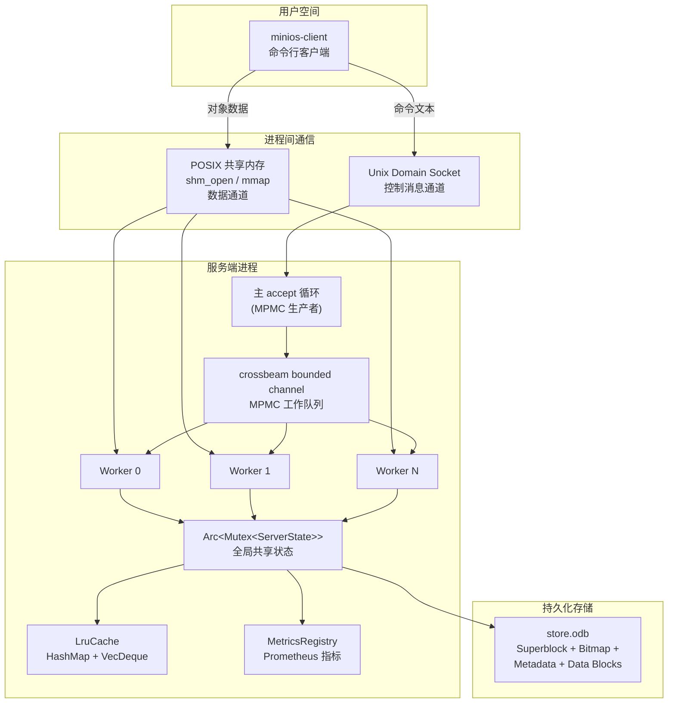

## 系统分析与设计

### **（1）设计思想：**

MiniOS（Mini Object Storage）是一个面向操作系统原理课程设计的简单对象存储系统。它摒弃了传统文件系统的层级目录结构，采用扁平化命名空间管理数据，所有对象持久化到一个自行设计的单一复合文档文件 `store.odb` 中。系统由服务端守护进程和命令行客户端组成，通过 Unix Domain Socket + POSIX 共享内存双通道进行进程间通信。

本项目贯穿了操作系统课程的多项核心原理，下面从操作系统视角阐述其主要设计思想。

**存储结构设计思想 —— 仿文件系统的自定义存储格式**

`store.odb` 文件的设计直接借鉴了 Unix-like 文件系统（如 ext2/ext4）的经典布局：将文件划分为超级块（Superblock）、元数据区（Metadata Area）、空闲块位图（Free Block Bitmap）和数据块区（Data Block Area）四个区域。超级块位于文件开头 4096 字节，记录魔数、版本、各区偏移量和全局统计信息，类比真实文件系统的超级块。元数据区每条 256 字节，存储对象 UUID、名称、大小、类型、标签、数据块链表头指针等，类比 inode 的设计。空闲块位图以 bit 为单位标记每个 4KB 数据块的占用状态（1=空闲, 0=占用），类比文件系统的块位图。数据块区中每个对象的数据以单向链表串联，每个块末尾 8 字节为 `next` 指针指向下一块，这直接对应操作系统教材中的**链式文件分配（Linked Allocation）**策略。

选择链表而非连续分配的原因是：避免外部碎片——数据块可以分散在文件各处，不需要寻找连续的空闲区域；简化位图——位图只需管理"占用/空闲"两种状态。代价是读取时需要多次磁盘寻道，这正是引入 LRU 缓存的原因，对应操作系统存储层次中"用缓存弥补磁盘 I/O 延迟"的设计思路。

**共享内存管理设计思想 —— 分页与段式管理的结合**

系统将 POSIX 共享内存（`shm_open` + `mmap`）的数据区按固定大小的页（4KB）进行划分，并在控制页（Page 0）中维护一个页分配位图。这直接对应操作系统内存管理中的**分页（Paging）**机制。页分配器实现了**首次适应（First-Fit）**算法在位图中查找连续的空闲页序列分配给一个对象使用——这是操作系统内存分配中最经典的算法之一。

大对象的分页传输则体现了分页与分段思想的结合：当一个对象超过单页容量时，客户端申请多页连续使用，数据被切分为若干个页大小的块依次写入各页。这类似于操作系统中"分段 + 分页"的组合管理方式——对象是一个逻辑段，内部按页存储。

当共享内存无足够连续空闲页时，`alloc_pages_wait()` 使用自旋等待策略：释放锁 → 休眠 10ms → 重新获取锁 → 重试。这与操作系统中信号量（Semaphore）和条件变量的等待-通知机制一脉相承。

**并发控制设计思想 —— 跨进程与跨线程双层同步**

这是本项目最能体现操作系统原理的设计。系统的并发控制分为四个层级：

第一层，MPMC 任务调度（`crossbeam::channel`）：主 accept 循环作为生产者将 `WorkItem` 推入有界通道，固定数量工作线程作为消费者拉取处理。这直接对应操作系统中**生产者-消费者问题**的经典模型，有界通道提供了天然的背压（backpressure）机制——队列满时拒绝新连接。

第二层，进程内互斥（`Arc<Mutex<ServerState>>`）：保护服务端全局状态，所有工作线程共享同一份状态但互斥访问，对应操作系统的**临界区（Critical Section）**保护。

第三层，跨进程互斥（`pthread_mutex_t` + `PTHREAD_PROCESS_SHARED`）：保护共享内存中的页分配位图，使服务端和多个客户端进程能够安全地并发分配/释放共享内存页。这是操作系统中最核心的**进程同步（Process Synchronization）**问题的实际应用——普通的 `pthread_mutex_t` 只能在同一进程的线程间共享，设置 `PTHREAD_PROCESS_SHARED` 属性后可以在不同进程间共享。POSIX 命名信号量（`sem_open`/`sem_wait`/`sem_post`）也被封装备用。

第四层，原子操作（`AtomicU32`）：保护客户端连接计数，无需锁的开销即可安全地增减，对应操作系统的**无锁同步（Lock-Free Synchronization）**。

锁的获取顺序始终固定为：`ServerState` 锁（内部锁）→ 页互斥锁（外部锁）。这种固定的锁序避免了死锁——对应操作系统教材中"防止死锁的锁排序（Lock Ordering）"策略。客户端在发送 socket 命令前释放页互斥锁，避免了"持有锁等待 I/O"的反模式。

**缓存设计思想 —— 局部性原理的实际应用**

服务端实现了 LRU（Least Recently Used，最近最少使用）对象缓存，使用 `HashMap + VecDeque` 组合实现 O(1) 的 get/put 操作。这直接对应操作系统存储层次中的**缓存替换策略**。LRU 基于**时间局部性（Temporal Locality）**：最近被访问的数据在未来很可能再次被访问。

缓存支持条目数和内存占用的双阈值淘汰机制，以及启动时的缓存预热（将常用对象预加载到内存中），对应操作系统中的**预取（Prefetching）**策略。当缓存满时，淘汰 `VecDeque` 头部（最久未使用的）条目，将新条目放在尾部——这是 LRU 的标准实现方式。

**进程管理设计思想 —— 守护进程化与信号处理**

服务端通过经典的 **double-fork** 技术转为守护进程：第一次 fork 后父进程退出、子进程调用 `setsid()` 成为新会话领导；第二次 fork 后第一个子进程退出、孙进程继续运行。这确保守护进程完全脱离终端控制，是 POSIX 系统编程的经典范式。注册 `SIGTERM`/`SIGINT` 信号处理器，通过全局 `AtomicBool` 标志实现优雅关闭——确保在退出前将超级块和位图刷新到磁盘，保证**数据一致性**。忽略 `SIGPIPE` 防止向已关闭 socket 写入时崩溃。PID 文件管理（读写/删除）用于服务状态跟踪和进程间信号传递。

**整体架构设计思想 —— 分层与模块化**

系统采用 Cargo workspace 组织为三个 crate：`minios-lib`（核心库）、`minios-server`（服务端）、`minios-client`（客户端）。核心库内部采用自底向上的分层架构：`common`（公共基础）→ `storage`（存储引擎）→ `shm`（共享内存）→ `cache`（缓存）→ `metrics`（监控）→ `protocol`（协议）/ `daemon`（守护进程）。每个模块职责单一、接口清晰，上层依赖下层，符合操作系统设计中的**分层架构**原则。

通信采用**双通道**架构：Unix Domain Socket 传输控制命令（文本协议），POSIX 共享内存传输对象数据。这种"控制平面与数据平面分离"的设计在操作系统和网络系统中广泛使用（如 TCP 的控制位与数据负载分离、软件定义网络 SDN 的控制器与数据平面分离），它避免了大数据在 socket 缓冲区中的多次拷贝，实现了零拷贝（zero-copy）传输。

---

### **（2）设计表示：**

**系统整体架构图**



**类与函数的规格说明**

*ObjectStore（存储引擎）*

`ObjectStore` 是 storage 模块的门面类，封装了对 `store.odb` 文件的所有操作。内部持有文件句柄、超级块、位图和全量元数据缓存。

| 方法 | 功能 |
|------|------|
| `create(path, max_objects, total_blocks)` | 创建新的 store.odb 文件，初始化超级块、位图区和元数据区 |
| `open(path)` | 打开已有存储文件，验证超级块和元数据校验和 |
| `put(name, data, content_type, tags)` | 存储对象：重名检测→分配数据块→写入块链表→生成 UUID→写入元数据→更新超级块 |
| `put_overwrite(name, data, content_type, tags)` | 强制覆盖存储：若名称已存在则先删除旧对象再写入新对象 |
| `get_by_id(uuid)` | 按 UUID 查找并读取完整对象数据（遍历块链表拼接） |
| `get_by_name(name)` | 按名称查找并读取完整对象数据 |
| `get_summary_by_id(uuid)` | 仅获取元数据摘要，不读取数据块 |
| `get_summary_by_name(name)` | 仅获取元数据摘要，不读取数据块 |
| `delete(uuid)` | 删除对象：遍历块链表释放所有数据块→标记元数据为 tombstone→更新超级块 |
| `list()` | 遍历元数据缓存，返回所有活跃对象的摘要 |
| `stats()` | 返回存储引擎统计信息 |
| `flush()` | 将超级块和位图持久化到磁盘 |

*BlockBitmap（自由块位图）*

| 方法 | 功能 |
|------|------|
| `new(total_blocks)` | 创建位图，所有块初始标记为空闲（1） |
| `from_bytes(data, total_blocks)` | 从字节数组反序列化位图 |
| `allocate_one()` | 分配一个空闲块（使用 `trailing_zeros()` 快速扫描），返回块索引 |
| `allocate_multi(count)` | 分配多个空闲块，失败时回滚已分配的块 |
| `free_block(block_idx)` | 释放指定块（幂等操作，安全地重复释放） |
| `free_blocks(indices)` | 批量释放块 |
| `to_bytes()` | 序列化为字节数组 |

*MetadataEntry（元数据条目）*

每条 256 字节，`#[repr(C)]` 保证内存布局与磁盘格式一致。包含 16 字节 UUID、64 字节名称、8 字节大小、32 字节内容类型、8 字节创建时间、64 字节标签、8 字节块链表头指针、4 字节块计数、1 字节 flags、1 字节 checksum（前 205 字节的 XOR 校验和）。

*LruCache（LRU 缓存）*

| 方法 | 功能 |
|------|------|
| `new(capacity, max_memory)` | 创建缓存，支持条目数和内存占用双阈值 |
| `get(id)` | 查找对象（O(1)），命中时 `hits+=1` 并更新 LRU 顺序，未命中时 `misses+=1` |
| `get_by_name(name)` | 按名称查找（通过 name_index 实现 O(1)） |
| `put(id, data, name, size)` | 插入缓存：超大对象跳过→处理同名冲突→循环淘汰直到有空间→插入 |
| `invalidate(id)` | 缓存失效（Delete 操作后调用） |
| `hit_rate()` | 返回当前命中率（hits / (hits + misses)） |
| `stats()` | 返回缓存统计快照 |
| `warmup(ids, loader, limit)` | 缓存预热：从存储加载最多 limit 个对象到缓存 |

*ShmRegion（共享内存区域）*

| 方法 | 功能 |
|------|------|
| `create(name, num_data_pages)` | 创建共享内存（`shm_open` + `ftruncate` + `mmap`），初始化控制头和互斥锁 |
| `open(name)` | 打开已有共享内存（客户端视角），验证控制头但不再初始化 |
| `destroy()` | 销毁互斥锁→`munmap`→`close`→`shm_unlink` |
| `write_to_pages(start_page, data)` | 将数据写入连续页面 |
| `read_from_pages(start_page, size)` | 从连续页面读取数据 |
| `lock_page_mutex()` / `unlock_page_mutex()` | 跨进程页分配互斥锁的加锁/解锁 |

*PageAllocator（页分配器）*

| 方法 | 功能 |
|------|------|
| `alloc_pages(count)` | First-Fit 连续分配（O(n) 逐位扫描） |
| `alloc_pages_wait(count, unlock, lock)` | 等待式分配：失败时 unlock→sleep(10ms)→lock→重试 |
| `free_pages(start_page, count)` | 释放连续页（幂等） |
| `has_contiguous(count)` | 检查是否存在 count 个连续空闲页 |
| `fragmentation_ratio()` | 计算碎片率 = 1 - max_contiguous / free_count |

*ShmQueue（跨进程请求/响应队列）*

基于 **4 个 POSIX 命名信号量 + 2 个跨进程互斥锁** 的有界缓冲区，实现客户端与服务端之间的命令/响应传递。

| 方法 | 功能 |
|------|------|
| `create(ctrl_page, header, shm_name, num_slots)` | 服务端：初始化队列头、互斥锁、信号量（初值 N/0/N/0）和槽位内存 |
| `open(ctrl_page, header, shm_name)` | 客户端：打开已存在的队列（验证魔数、打开信号量和互斥锁） |
| `is_available(ctrl_page, header)` | 静态检查：通过魔数 "MOSQ" 判断队列是否已初始化 |
| `push_request(client_id, cmd)` | 客户端生产者：P(req_empty)→lock→写入槽位→推进 head→unlock→V(req_full) |
| `pop_request(timeout_ms, shutdown)` | 服务端消费者：sem_timedwait(req_full)→lock→读取槽位→推进 tail→unlock→V(req_empty) |
| `push_response(client_id, resp)` | 服务端生产者：P(resp_empty)→lock→写入槽位→推进 head→unlock→V(resp_full) |
| `pop_response()` | 客户端消费者：P(resp_full)→lock→读取槽位→推进 tail→unlock→V(resp_empty) |
| `wake_all()` | 向 4 个信号量各 post 一次，用于关闭时解除阻塞 |
| `destroy()` / `close()` | 清理信号量（unlink/close）和互斥锁 |

**关键函数的流程图和伪代码**

*PUT 操作流程（小文件单次传输）*

```
客户端：
1. data = std::fs::read(file)               // 读文件到内存
2. lock(page_mutex)                         // 获取跨进程锁
3. start_page = alloc_pages_wait(N)         // First-Fit 连续分配 N 页
4. write_to_pages(start_page, data)         // 写入共享内存
5. unlock(page_mutex)                       // 释放锁（在发送命令前！）
6. socket_send("PUT name size type tags start_page N")

服务端（Worker 线程）：
1. lock(ServerState)                        // 获取全局状态锁
2. lock(page_mutex)                         // 获取页锁
3. data = read_from_pages(start_page, size) // 从共享内存读取
4. free_pages(start_page, N)               // 释放页（由服务端释放！）
5. unlock(page_mutex)
6. slot = find_free_slot()                  // 查找空闲元数据槽位
7. block_indices = bitmap.allocate_multi(count) // 分配数据块
8. for i in 0..count:                      // 逐块写入
       write_data_block(block_indices[i], payload[i], next_ptr)
9. uuid = Uuid::new_v4()                   // 生成 UUID
10. entry = MetadataEntry::new(...)          // 创建元数据条目
11. entry.update_checksum()                 // 计算 XOR 校验和
12. write_metadata_entry(slot, entry)       // 持久化元数据
13. superblock.total_objects += 1           // 更新超级块统计
14. flush_bitmap(); flush_superblock(); fsync()
15. cache.put(uuid, data, name, size)       // 放入缓存
16. snapshot_metrics()                      // 更新 Prometheus 指标
17. unlock(ServerState)
18. socket_reply("OK <uuid>")
```

*GET 操作流程（缓存优先策略）*

```
服务端（Worker 线程）：
1. lock(ServerState)
2. if parse_uuid(id):
       data = cache.get(&uuid)             // 第一步：查缓存
       if data is None:
           obj = store.get_by_id(&uuid)    // 第二步：从磁盘读
           data = obj.data
           cache.put(uuid, data, name, size) // 第三步：放入缓存
   else:
       data = cache.get_by_name(id)        // 按名称查缓存
       if data is None:
           obj = store.get_by_name(id)     // 从磁盘读
           data = obj.data
           cache.put(uuid, data, name, size)
3. lock(page_mutex)
4. start_page = alloc_pages_wait(pages_needed) // 在共享内存中分配空间
5. write_to_pages(start_page, data)        // 写入共享内存
6. unlock(page_mutex)
7. unlock(ServerState)
8. socket_reply("OK size start_page num_pages")

客户端：
1. resp = socket_cmd("GET <id>")
2. 解析响应：size, start_page, num_pages
3. lock(page_mutex)
4. data = read_from_pages(start_page, size) // 从共享内存读取
5. free_pages(start_page, num_pages)       // 客户端释放页！
6. unlock(page_mutex)
7. 输出到 stdout 或写入文件
```

*分块上传协议（大文件）*

```
客户端：
1. socket_send("PUT_BEGIN name total_size type tags")
2. offset = 0
3. while offset < total_size:
       chunk = data[offset..min(offset+max_chunk, total_size)]
       lock(page_mutex)
       start_page = alloc_pages_wait(pages_needed)
       write_to_pages(start_page, chunk)
       unlock(page_mutex)
       resp = socket_send("PUT_CHUNK name chunk_size start_page pages")
       if resp is ERROR:
           lock → free_pages → unlock    // 错误时客户端自行清理
           return
       offset += chunk.len
4. socket_send("PUT_END name")  // 或 PUT_END_FORCE
```

---

### **（3）详细设计表示：**

**内存数据结构**

1. **Superblock（超级块，4096 bytes）**：位于文件头部，`#[repr(C)]` 保证字段布局与磁盘一致。关键字段：`magic`（b"MOSB"）、`version`（1）、`total_objects`、各区偏移量和大小（`metadata_area_offset/size`、`free_bitmap_offset/size`、`data_area_offset`）、数据块总数和空闲数、时间戳、3976 字节保留字段。

2. **MetadataEntry（元数据条目，256 bytes）**：`#[repr(C)]` 内存布局与磁盘完全一致。字段顺序为 uuid（16B）→ name（64B）→ size（8B）→ content_type（32B）→ created_at（8B）→ tags（64B）→ block_ptr_head（8B）→ block_count（4B）→ flags（1B）→ checksum（1B）→ _reserved（50B）。`flags` 定义三种状态：FREE（0x00）、ACTIVE（0x01）、TOMBSTONE（0x02）。校验和为前 205 字节的 XOR。

3. **BlockBitmap（块位图）**：内部 `Vec<u64>` 存储，每个 u64 管理 64 个数据块。位值为 1 表示空闲，0 表示占用。`trailing_zeros()` 指令实现字级快速扫描。

4. **LruCache（LRU 缓存）**：核心数据结构为 `HashMap<ObjectId, CacheEntry>`（O(1) 查找数据）+ `HashMap<String, ObjectId>`（名称→UUID 索引）+ `VecDeque<ObjectId>`（维护访问顺序，队首=最久未用，队尾=最近使用）。支持条目数和内存占用双阈值淘汰。

5. **ShmControlHeader（共享内存控制头，~32 bytes）**：位于共享内存 Page 0 开头。包含魔数（b"MOSM"）、版本、页大小（4096）、总页数、空闲页数、位图偏移量和大小。

6. **PageAllocator（页分配器）**：指向共享内存中页分配位图、总页数、空闲页计数器的三个指针组成。位图以字节数组存储，1=空闲，0=占用。需要连续分配，使用 First-Fit 算法逐位扫描。

7. **ServerState（服务端全局状态）**：`Arc<Mutex<ServerState>>` 包裹，包含 `ObjectStore`、`LruCache`、`ShmRegion`、`PageAllocator`、`pending_uploads: HashMap<String, PendingUpload>`、`MetricsRegistry`。所有工作线程共享同一实例。

8. **PendingUpload（分块上传缓冲区）**：包含 `data: Vec<u8>`（累积数据）、`content_type`、`tags`。每次 `PUT_CHUNK` 时追加数据，`PUT_END` 时一次性写入存储。

9. **WorkItem（MPMC 工作项）**：枚举类型，包含 `Command { stream: UnixStream, command: String }` 和 `Shutdown` 两个变体。通过 `crossbeam::channel::bounded` 有界通道传输。

10. **ShmRequest/ShmResponse（协议槽位，各 256 bytes）**：`#[repr(C)]` 固定大小结构体，为后续升级为纯共享内存队列协议预留扩展基础。

11. **ShmQueueHeader（队列控制头，32 bytes）**：位于控制页中 page_mutex 之后。包含魔数（b"MOSQ"）、版本（1）、槽位数（num_slots）、请求/响应队列的 head 和 tail 指针。

12. **QueueRequest（请求槽位，256 bytes）**：`#[repr(C)]` 布局：client_id(4B) + status(1B) + _pad(3B) + command_text(248B)。承载与 socket 协议完全相同的空格分隔文本命令。

13. **QueueResponse（响应槽位，256 bytes）**：`#[repr(C)]` 布局：client_id(4B) + status(1B) + _pad(3B) + response_text(248B)。承载文本响应。

14. **ShmQueue（跨进程请求/响应队列）**：封装 4 个 POSIX 命名信号量（req_empty/req_full/resp_empty/resp_full）、2 个跨进程互斥锁（req_mutex/resp_mutex）和指向共享内存中队列槽位的指针。实现经典的生产者-消费者有界缓冲区模式。

**外存文件格式（store.odb）**

`store.odb` 是一个单一复合文档文件，将超级块、元数据、位图、数据块四个区域打包在同一文件中。

```
┌──────────────────────────────────────────────────────────────┐
│                    store.odb 文件布局                          │
├────────────┬─────────────────────────────────────────────────┤
│ Superblock │ 4096 字节文件头。魔数 "MOSB"、版本号=1、          │
│ (4 KB)     │ 各区偏移量、时间戳、统计信息。小端序序列化。         │
├────────────┼─────────────────────────────────────────────────┤
│ Metadata   │ N × 256 字节的元数据条目。4KB 对齐。               │
│ Area       │ 每条记录：UUID(16B) + name(64B) + size(8B)       │
│ (对齐到4KB) │ + content_type(32B) + created_at(8B) +           │
│            │ tags(64B) + block_ptr_head(8B) +                 │
│            │ block_count(4B) + flags(1B) + checksum(1B)       │
│            │ + _reserved(50B)。flags: 0=空闲 1=活跃 2=墓碑     │
├────────────┼─────────────────────────────────────────────────┤
│ Free Block │ ceil(total_blocks/8) 字节，4KB 对齐。              │
│ Bitmap     │ 每 bit 对应一个数据块：1=空闲, 0=占用。            │
│            │ 内部 Vec<u64> 存储，小端序。                      │
├────────────┼─────────────────────────────────────────────────┤
│ Data Block │ M × 4096 字节的数据块。                           │
│ Area       │ ┌──────────────┬──────────┐                     │
│            │ │ payload      │ next_ptr │ ← 4088 + 8 bytes    │
│            │ │ (4088 bytes) │ (8 bytes)│                     │
│            │ └──────────────┴──────────┘                     │
│            │ next_ptr = u64::MAX 表示链表结束                  │
└────────────┴─────────────────────────────────────────────────┘
```

各区偏移量计算公式（在 `Superblock::new()` 中实现）：

```
metadata_area_offset = 4096
metadata_area_size   = align_up(max_entries × 256, 4096)
free_bitmap_offset   = metadata_area_offset + metadata_area_size
free_bitmap_size     = align_up(ceil(total_blocks / 8), 4096)
data_area_offset     = free_bitmap_offset + free_bitmap_size
data_block_payload   = 4096 - 8 = 4088
```

数据块通过单向链表串联：元数据中的 `block_ptr_head` 指向第一个块索引，每个块的末尾 8 字节 `next_ptr` 指向下一个块索引，最后一个块的 `next_ptr = u64::MAX` 表示链表结束。块不需要连续分配（链式分配），位图只需找任意空闲块。

共享内存区域布局（包含新增的请求/响应队列）：

```
Page 0 (控制页, 4096 B):
├── ShmControlHeader (~28 B): magic="MOSM", version, page_size, total_pages, free_pages
├── Page Bitmap (ceil(total_pages/8) B, 8字节对齐): 1=空闲, 0=占用
├── pthread_mutex_t (~40-64 B, PTHREAD_PROCESS_SHARED 属性) — 页分配锁
├── ShmQueueHeader (32 B): magic="MOSQ", num_slots=N, req/resp head/tail 索引
├── pthread_mutex_t (~40-64 B) — 请求队列锁 (req_mutex)
├── pthread_mutex_t (~40-64 B) — 响应队列锁 (resp_mutex)
├── QueueRequest[0..N-1]  (N × 256 B) — 请求环形缓冲区
└── QueueResponse[0..N-1] (N × 256 B) — 响应环形缓冲区

Page 1..N (数据页, 每页 4096 B):
├── 用于传输对象数据
```

**信号量（命名 POSIX，派生自 SHM 名称）**：

| 信号量 | 初值 | 语义 | P(wait) 调用者 | V(post) 调用者 |
|--------|------|------|----------------|----------------|
| `{shm}_req_empty` | N | 请求空闲槽位数 | 客户端 | 服务端 |
| `{shm}_req_full` | 0 | 请求就绪槽位数 | 服务端 | 客户端 |
| `{shm}_resp_empty` | N | 响应空闲槽位数 | 服务端 | 客户端 |
| `{shm}_resp_full` | 0 | 响应就绪槽位数 | 客户端 | 服务端 |

这是 Dijkstra (1965) 经典论文中**生产者-消费者问题**的完整实现，直接对应操作系统教材中"用信号量实现进程间同步"的核心例题。

**界面设计**

客户端命令行接口（基于 clap derive）：

| 命令 | 格式 | 说明 |
|------|------|------|
| `put` | `minios put <file> [--name] [--content-type] [--tags] [-f]` | 上传文件，自动判断单次/分块传输，`-f` 强制覆盖 |
| `get` | `minios get <uuid_or_name> [-o <path>]` | 下载对象，默认输出到 stdout |
| `info` | `minios info <uuid_or_name>` | 查看对象元数据（不下载数据） |
| `delete` | `minios delete <uuid>` | 删除对象 |
| `list` | `minios list` | 列出所有对象 |
| `status` | `minios status` | 查看服务端状态（存储、缓存、共享内存） |
| `start` | `minios start [--server] [--daemon]` | 启动服务端进程 |
| `stop` | `minios stop` | 停止服务端 |

服务端命令行参数：

| 参数 | 默认值 | 说明 |
|------|--------|------|
| `--store-path` | `./store.odb` | 存储文件路径 |
| `--socket-path` | `/tmp/minios.sock` | Unix Socket 路径 |
| `--shm-name` | `minios_shm` | 共享内存名称 |
| `--shm-pages` | `256` | 共享内存数据页数（~1MB） |
| `--cache-capacity` | `128` | LRU 缓存条目容量 |
| `--cache-memory-mb` | `64` | LRU 缓存最大内存占用 |
| `--max-objects` | `1024` | 最大对象数 |
| `--total-blocks` | `4096` | 数据块总数 |
| `--max-clients` | `16` | 最大并发客户端数 |
| `--worker-threads` | `4` | 工作线程池大小 |
| `--metrics-port` | `9090` | Prometheus HTTP 端口（0=禁用） |
| `--daemon` | `false` | 守护进程模式 |
| `--pidfile` | `/tmp/minios.pid` | PID 文件路径 |

通信协议（Unix Socket 文本协议，空格分隔，`\n` 结尾）：

| 命令 | 格式 |
|------|------|
| PUT | `PUT <name> <size> <content_type> <tags> <start_page> <num_pages>\n` |
| PUT_FORCE | `PUT_FORCE <name> <size> <content_type> <tags> <start_page> <num_pages>\n` |
| PUT_BEGIN | `PUT_BEGIN <name> <total_size> <content_type> <tags>\n` |
| PUT_CHUNK | `PUT_CHUNK <name> <chunk_size> <start_page> <num_pages>\n` |
| PUT_END | `PUT_END <name>\n` |
| GET | `GET <uuid_or_name>\n` |
| INFO | `INFO <uuid_or_name>\n` |
| DELETE | `DELETE <uuid>\n` |
| LIST | `LIST\n` |
| STATUS | `STATUS\n` |
| STOP | `STOP\n` |

成功响应以 `OK` 开头，错误以 `ERROR` 开头，后跟描述信息。

Prometheus 监控接口（HTTP `GET /metrics`）暴露 14 个指标：`minios_uptime_seconds`（Gauge）、`minios_active_connections`（Gauge）、`minios_connections_total`（Counter）、`minios_requests_total`（Counter）、`minios_store_objects`（Gauge）、`minios_store_blocks_free`（Gauge）、`minios_store_blocks_total`（Gauge）、`minios_store_file_size_bytes`（Gauge）、`minios_cache_entries`（Gauge）、`minios_cache_hits_total`（Counter）、`minios_cache_misses_total`（Counter）、`minios_cache_evictions_total`（Counter）、`minios_shm_pages_free`（Gauge）、`minios_shm_pages_total`（Gauge）。指标在每次请求处理后通过 `snapshot_metrics()` 更新，HTTP 线程独立运行。
