# Minios 对象存储服务 — 设计文档

## 1. 系统概述

MiniOS（Mini Object Storage）是一个简单的对象存储服务，采用扁平化命名空间管理数据，
所有对象持久化到单一复合文档文件 `store.odb` 中。系统由服务端守护进程和命令行客户端组成，
通过 Unix Domain Socket + POSIX 共享内存双通道进行进程间通信。

### 1.1 系统架构

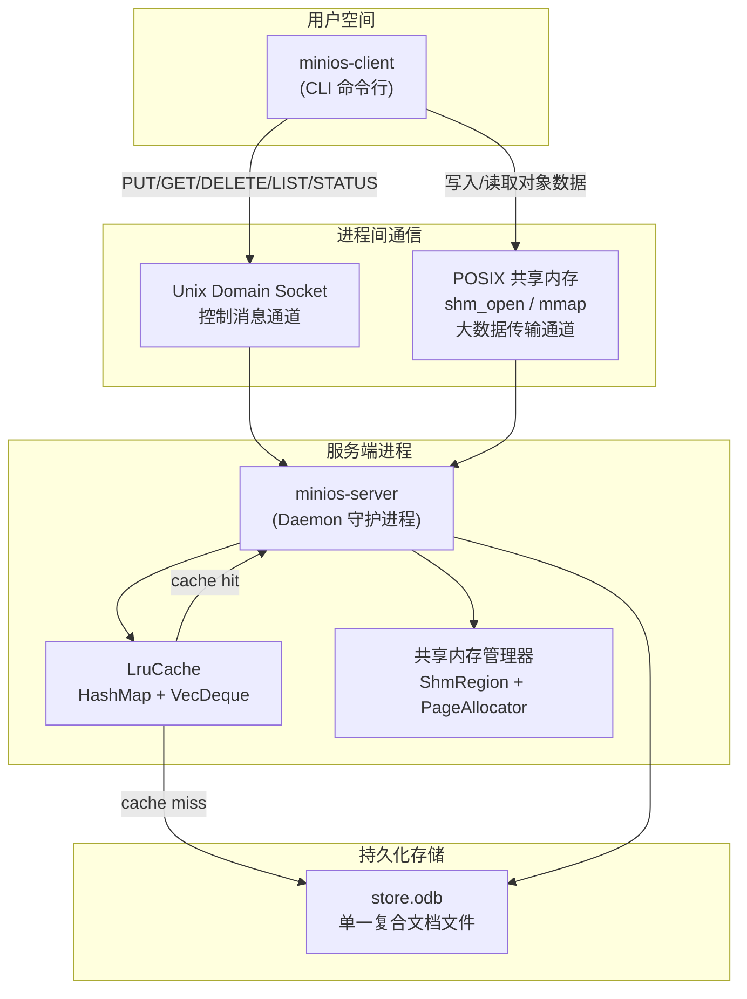

### 1.2 请求处理流程

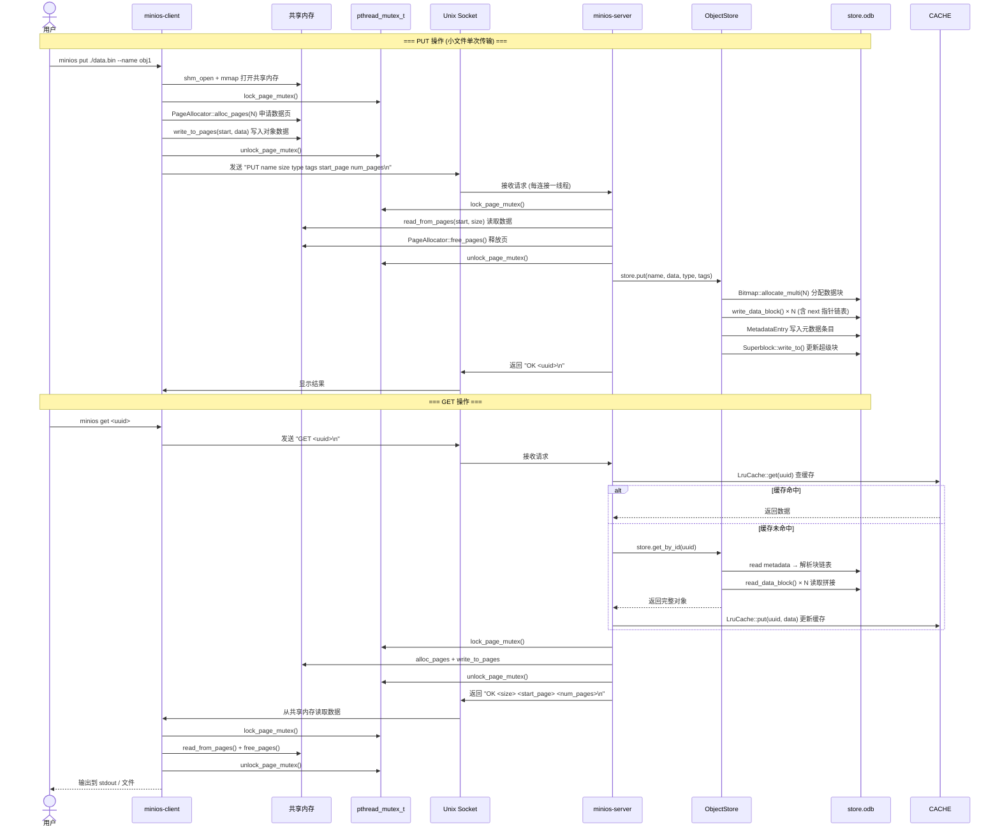

### 1.3 模块依赖关系

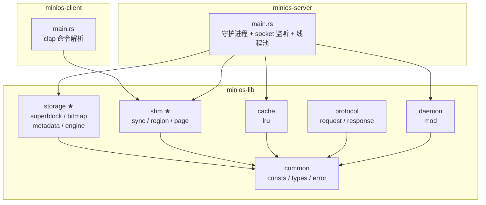

---

## 2. store.odb 文件格式

### 2.1 整体布局

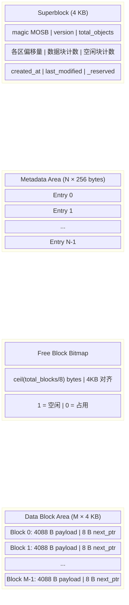

### 2.2 元数据条目布局（256 bytes）

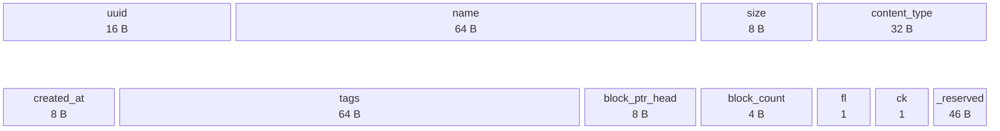

### 2.3 数据块链表结构

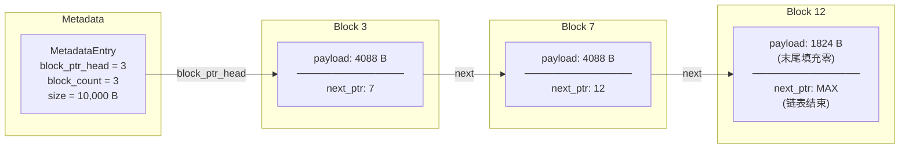

### 2.4 位图分配算法

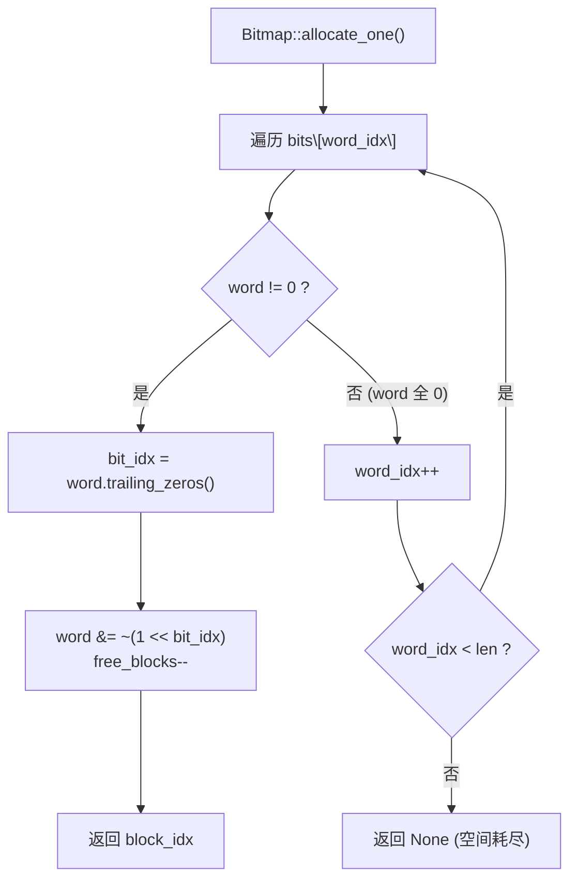

---

## 3. 共享内存缓冲区管理

### 3.1 区域布局

控制页（Page 0，4096 bytes）布局：

| 区域 | 偏移 | 大小 | 说明 |
|------|------|------|------|
| `ShmControlHeader` | 0 | ~32 B | 魔数、版本、页大小、总页数、空闲页数、位图偏移/大小 |
| Page Bitmap | `page_bitmap_offset` | `ceil(total/8)` B (8 字节对齐) | 页分配位图，1=空闲，0=占用 |
| `pthread_mutex_t` | 位图之后 (按 `pthread_mutex_t` 对齐) | ~40 B | 跨进程页分配互斥锁 (`PTHREAD_PROCESS_SHARED`) |
| (保留) | 互斥锁之后 | 剩余空间 | 未使用 |

数据页从 Page 1 开始，共 `total_pages` 页，每页 4096 bytes。

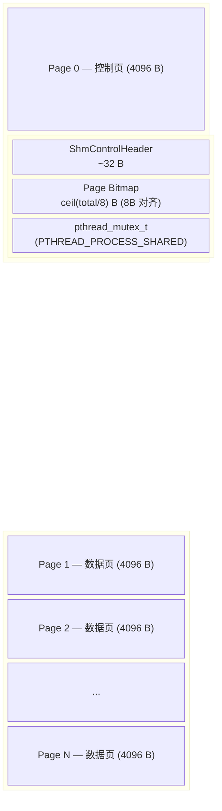

### 3.2 页分配 First-Fit 算法

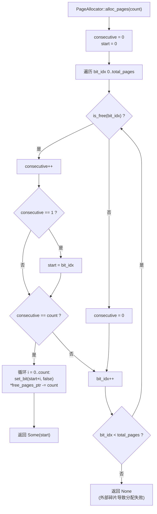

### 3.3 跨进程页分配同步

页分配位图位于共享内存中，服务端和多个客户端可能同时访问。为保证分配/释放的原子性，
使用位于控制页中的 `pthread_mutex_t`（`PTHREAD_PROCESS_SHARED` 属性）进行跨进程互斥。

**锁的获取模式**：

| 操作 | 客户端 | 服务端 |
|------|--------|--------|
| PUT (小文件) | lock → alloc → write → unlock → socket_cmd | lock(state) → lock(page) → read → free → unlock(page) → store.put |
| PUT (分块) | lock → alloc → write → unlock → socket_cmd (每块) | lock(state) → lock(page) → read → free → unlock(page) → 追加缓冲区 |
| GET | socket_cmd → lock → read → free → unlock | lock(state) → lock(page) → alloc → write → unlock(page) |

**关键设计：客户端在发送 socket 命令前释放锁。**

客户端不在持有页锁期间等待服务端响应，避免死锁。
服务端处理请求时先获取 `ServerState` 锁（`Arc<Mutex<>>`），
再获取页锁——两把锁始终按相同顺序获取：

```
ServerState 锁 (内部锁) → 页互斥锁 (外部锁)
```

客户端只持有页锁，不持有 `ServerState` 锁，因此不会发生锁序反转。

**PUT 操作生命周期**：
1. 客户端：lock → alloc → write → unlock → 发送 socket 命令
2. 服务端：收到命令 → lock(state) → lock(page) → read → free → unlock(page) → store.put → unlock(state)
3. 页由服务端释放，客户端不重复释放（避免并发竞态）

**GET 操作生命周期**：
1. 客户端：发送 socket 命令，收到响应
2. 服务端：lock(state) → 查缓存/store → lock(page) → alloc → write → unlock(page) → unlock(state) → 返回页号
3. 客户端：lock → read → free → unlock（客户端释放页）

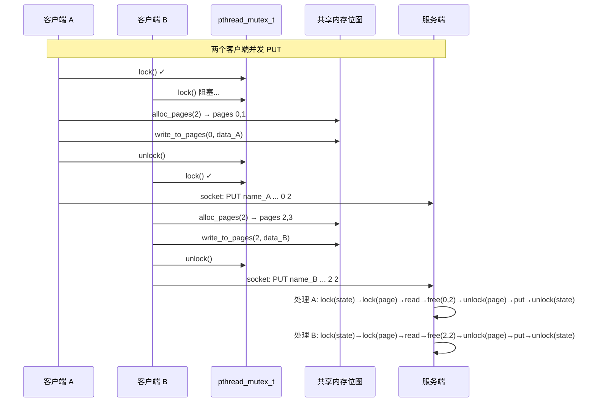

---

## 4. LRU 缓存

### 4.1 数据结构

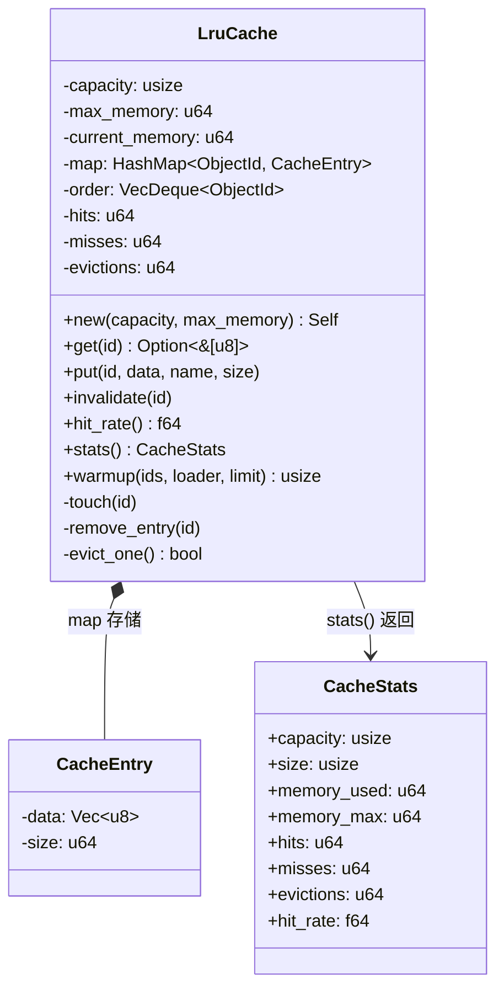

### 4.2 淘汰流程

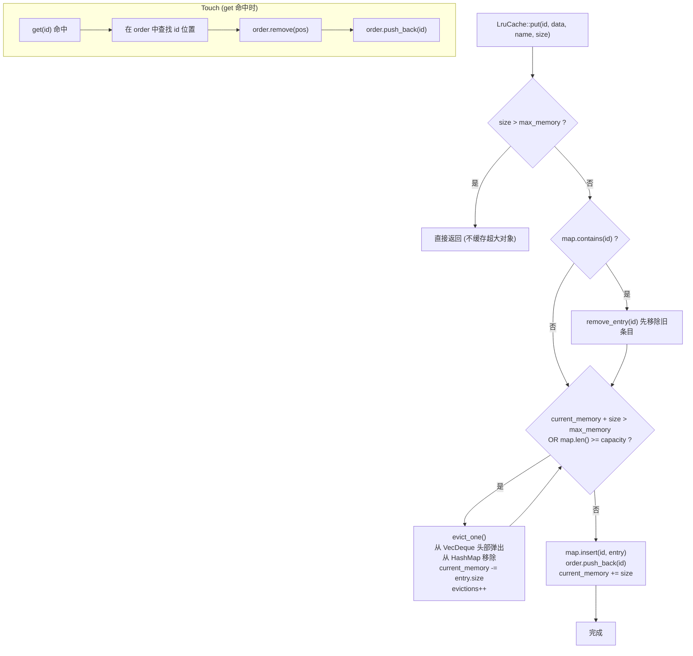

---

## 5. 通信协议

系统采用 **双通道** 架构：

- **控制通道**：Unix Domain Socket，文本协议，每次请求一个连接
- **数据通道**：POSIX 共享内存 (`shm_open`/`mmap`)，传输对象数据

### 5.1 命令格式

所有命令以 `\n` 结尾，服务端返回以 `\n` 结尾的文本响应。

**基础命令**：

| 命令 | 格式 | 响应 | 说明 |
|------|------|------|------|
| `PUT` | `PUT <name> <size> <content_type> <tags> <start_page> <num_pages>\n` | `OK <uuid>\n` | 小文件单次上传 |
| `GET` | `GET <uuid_or_name>\n` | `OK <size> <start_page> <num_pages>\n` | 下载对象 |
| `DELETE` | `DELETE <uuid>\n` | `OK deleted\n` | 删除对象 |
| `LIST` | `LIST\n` | `OK <count>\n` + 每行一个对象 | 列出所有对象 |
| `STATUS` | `STATUS\n` | `OK\n` + 多行统计信息 | 查看服务端状态 |
| `STOP` | `STOP\n` | `OK shutting down\n` | 停止服务端 |

**错误响应**：以 `ERROR` 开头，后跟描述信息。

### 5.2 分块上传协议

大文件（超过共享内存容量）通过三步协议分块上传：

| 步骤 | 命令 | 说明 |
|------|------|------|
| 1. 开始 | `PUT_BEGIN <name> <total_size> <content_type> <tags>\n` | 服务端创建上传缓冲区 (`PendingUpload`) |
| 2. 循环 | `PUT_CHUNK <name> <chunk_size> <start_page> <num_pages>\n` | 服务端从共享内存读取块，追加到缓冲区，释放页 |
| 3. 结束 | `PUT_END <name>\n` | 服务端将完整数据写入 `store.odb`，清理缓冲区 |

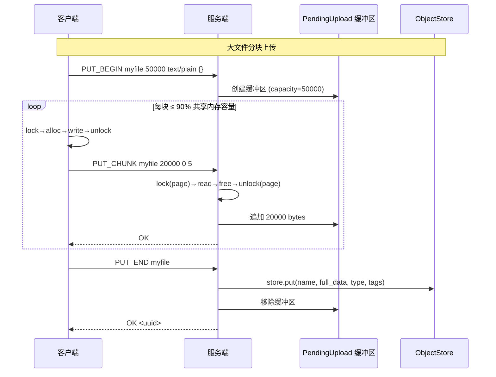

**设计要点**：
- 每块最多使用 90% 的共享内存页，保留少量页避免碎片导致的分配失败
- 正常路径：页由服务端在 `PUT_CHUNK` 中释放，客户端不重复释放
- 错误路径：服务端返回 ERROR 时未释放页，客户端需自行清理
- `PUT_END` 之后数据才真正持久化到 `store.odb`

### 5.3 通信模式

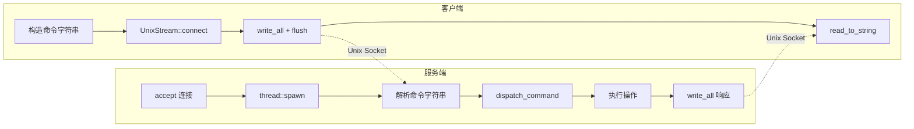

服务端采用 **每连接一线程** 模型：`UnixListener` 设为非阻塞模式，
主循环以 50ms 间隔轮询 `accept()`，每次 accept 成功后 `thread::spawn` 处理。
这种模型足够简单，适合课程设计场景。

---

## 6. 模块组织

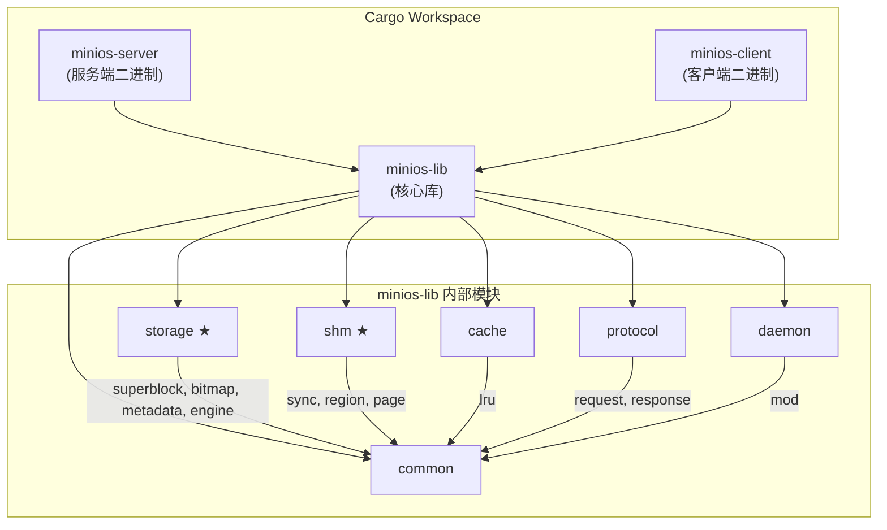

---

## 7. 测试策略

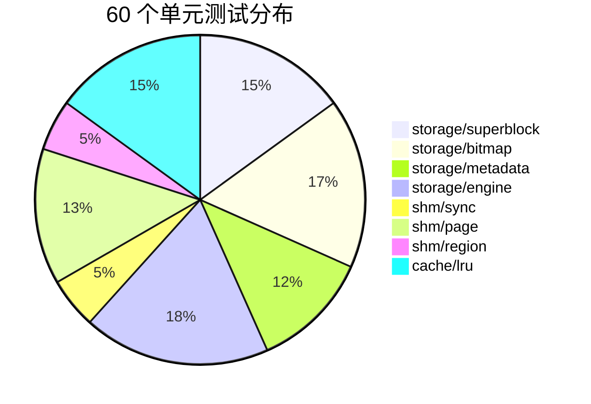

| 模块 | 测试数 | 覆盖要点 |
|------|--------|----------|
| superblock | 9 | 创建、序列化往返、魔数/版本校验、文件读写、时间戳 |
| bitmap | 10 | 单块分配、多块分配、耗尽、释放、幂等释放、序列化 |
| metadata | 7 | 空闲条目、活跃条目、校验和、序列化、中文名、截断 |
| engine | 11 | 创建/打开、Put/Get/Delete/List、大对象跨块、持久化、统计 |
| shm/sync | 3 | 互斥锁加解锁、信号量 wait/post、try_wait |
| shm/page | 8 | 单页分配、多页连续、耗尽、碎片、碎片率、边界 |
| shm/region | 3 | 创建/销毁、写入/读取、打开已存在区域 |
| cache/lru | 9 | 存/取、未命中、命中率、条目淘汰、内存淘汰、LRU 顺序、失效、预热 |

### 7.1 手动并发测试注意事项

服务端在集成测试中通常以 `./target/release/minios-server ... &` 的形式作为当前
shell 的后台任务运行。编写并发上传测试时，需要记录每个测试子进程的 PID，并逐个
`wait "$pid"`；不能直接使用无参数 `wait`，否则 shell 会同时等待仍在运行的
`minios-server`，造成测试脚本看起来卡住。

该现象属于测试脚本等待范围错误，不是共享内存页锁或服务端请求处理线程死锁。客户端
并发 `put` 返回 `OK <uuid>` 后已经完成上传，后续阻塞发生在 shell 等待后台任务阶段。
