# Minios 对象存储服务 — 设计文档

## 1. 系统概述

MiniOS（Mini Object Storage）是一个简单的对象存储服务，采用扁平化命名空间管理数据，
所有对象持久化到单一复合文档文件 `store.odb` 中。系统由服务端守护进程和命令行客户端组成，
通过 Unix Domain Socket + POSIX 共享内存双通道进行进程间通信。

### 1.1 系统架构

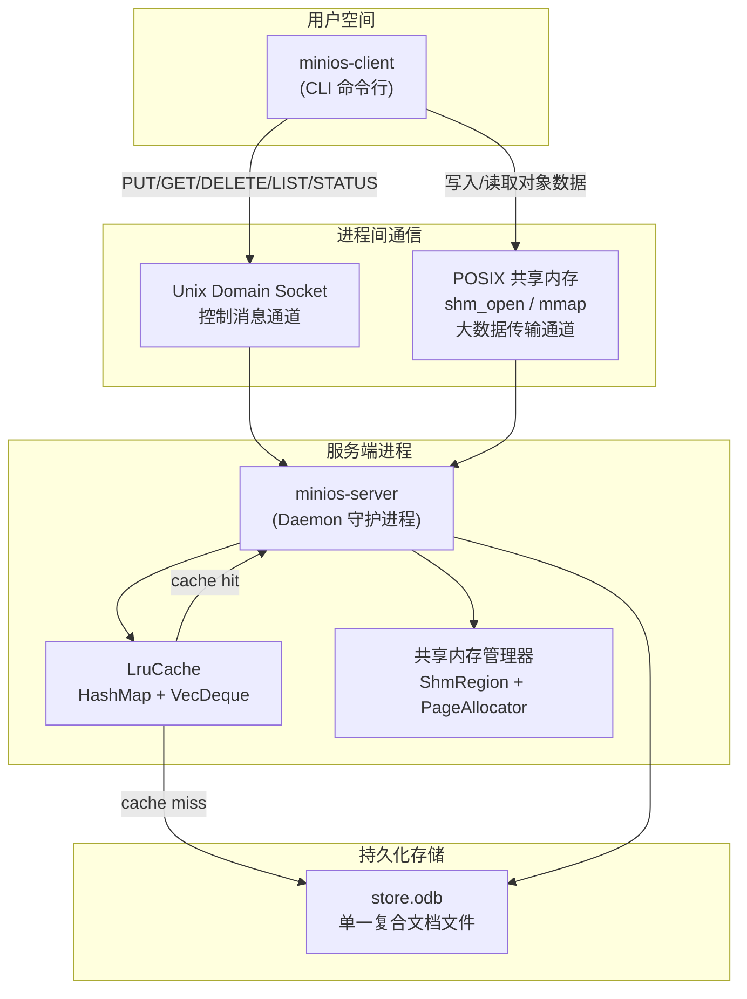

### 1.2 请求处理流程

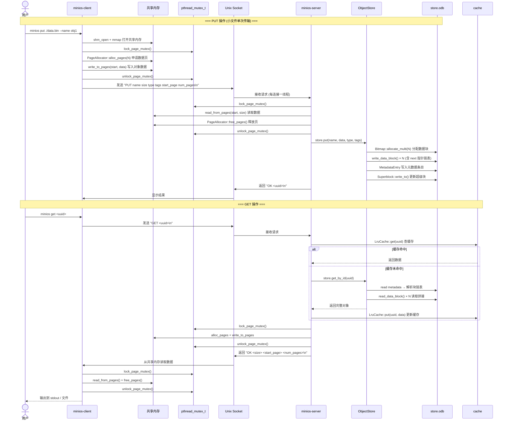

### 1.3 模块依赖关系

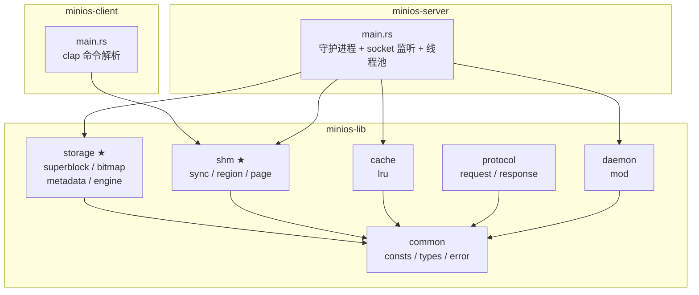

---

## 2. store.odb 文件格式

### 2.1 整体布局

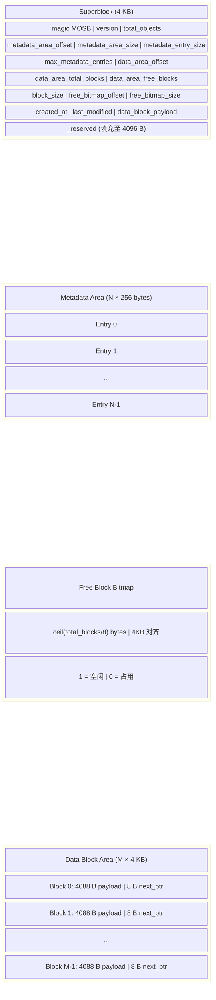

### 2.2 超级块字段详细列表（4096 bytes，小端序）

| 偏移 | 大小 | 字段 | 说明 |
|------|------|------|------|
| 0 | 4 | `magic` | 魔数，固定 `b"MOSB"` |
| 4 | 4 | `version` | 格式版本，当前为 1 |
| 8 | 8 | `total_objects` | 活跃对象总数 |
| 16 | 8 | `metadata_area_offset` | 元数据区起始偏移，恒为 4096 |
| 24 | 8 | `metadata_area_size` | 元数据区大小（4KB 对齐） |
| 32 | 8 | `metadata_entry_size` | 单条元数据大小，恒为 256 |
| 40 | 8 | `max_metadata_entries` | 最大元数据条目数 |
| 48 | 8 | `data_area_offset` | 数据块区起始偏移 |
| 56 | 8 | `data_area_total_blocks` | 数据块总数 |
| 64 | 8 | `data_area_free_blocks` | 当前空闲数据块数 |
| 72 | 8 | `block_size` | 单块大小，恒为 4096 |
| 80 | 8 | `free_bitmap_offset` | 位图区起始偏移 |
| 88 | 8 | `free_bitmap_size` | 位图区大小（4KB 对齐） |
| 96 | 8 | `created_at` | 创建时间（Unix 时间戳） |
| 104 | 8 | `last_modified` | 最后修改时间（Unix 时间戳） |
| 112 | 8 | `data_block_payload` | 每块有效载荷大小，恒为 4088 |
| 120 | 3976 | `_reserved` | 保留字段，填充至 4096 字节 |

各区偏移量计算：
- `metadata_area_offset = 4096`（紧接超级块）
- `metadata_area_size = align_up(max_metadata_entries × 256, 4096)`
- `free_bitmap_offset = metadata_area_offset + metadata_area_size`
- `free_bitmap_size = align_up(ceil(total_blocks / 8), 4096)`
- `data_area_offset = free_bitmap_offset + free_bitmap_size`
- `data_block_payload = 4096 - 8 = 4088`（每个数据块末尾 8 字节为 next 指针）

### 2.3 元数据条目布局（256 bytes）

```
偏移     大小    字段
  0..16   16 B   uuid           [u8; 16]
 16..80   64 B   name           [u8; 64]  (null-terminated, 最大 63 字符)
 80..88    8 B   size           u64
 88..120  32 B   content_type   [u8; 32]  (null-terminated, 最大 31 字符)
120..128   8 B   created_at     i64       (Unix 时间戳)
128..192  64 B   tags           [u8; 64]  (null-terminated, 最大 63 字符)
192..200   8 B   block_ptr_head u64       (数据块链表头索引)
200..204   4 B   block_count    u32       (占用的数据块数)
204        1 B   flags          u8        (0=空闲, 1=活跃, 2=tombstone)
205        1 B   checksum       u8        (bytes 0..205 的 XOR 校验和)
206..256  50 B   _reserved      [u8; 50]
```

校验和算法：对条目前 205 字节逐字节 XOR，结果写入 `checksum` 字段。
启动时验证每个活跃条目的校验和，不匹配则拒绝打开存储文件。

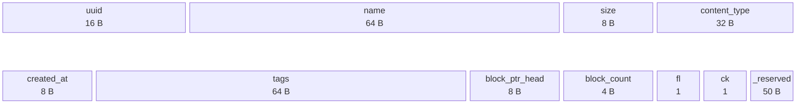

### 2.4 数据块链表结构

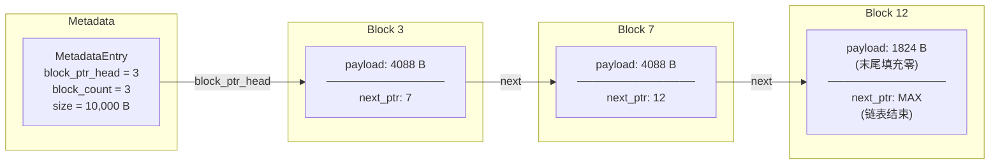

### 2.5 位图分配算法

数据块不需要连续分配，通过块内 next 指针形成链表。位图以 `Vec<u64>` 存储，
利用 `trailing_zeros()` 指令进行快速字级扫描。

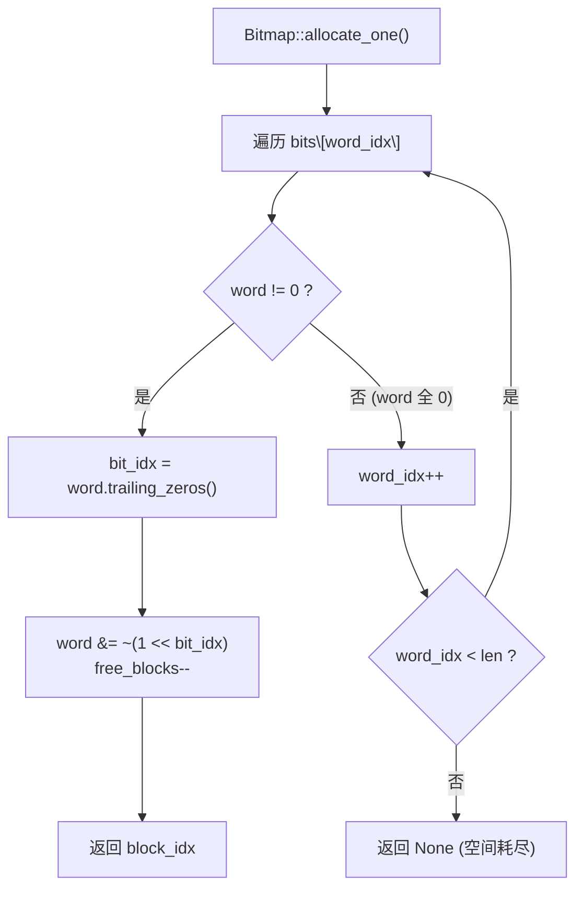

`allocate_multi(count)` 循环调用 `allocate_one()`；若中途失败则回滚已分配的块。

---

## 3. 共享内存缓冲区管理

### 3.1 区域布局

控制页（Page 0，4096 bytes）布局：

| 区域 | 偏移 | 大小 | 说明 |
|------|------|------|------|
| `ShmControlHeader` | 0 | ~32 B | 魔数、版本、页大小、总页数、空闲页数、位图偏移/大小 |
| Page Bitmap | `page_bitmap_offset` | `ceil(total/8)` B (8 字节对齐) | 页分配位图，1=空闲，0=占用 |
| `pthread_mutex_t` | 位图之后 (按 `pthread_mutex_t` 对齐) | ~40 B | 跨进程页分配互斥锁 (`PTHREAD_PROCESS_SHARED`) |
| (保留) | 互斥锁之后 | 剩余空间 | 未使用 |

数据页从 Page 1 开始，共 `total_pages` 页，每页 4096 bytes。

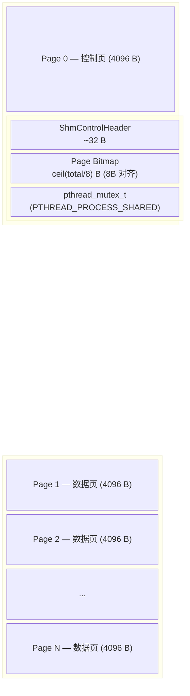

### 3.2 页分配算法

#### First-Fit 分配 (`alloc_pages`)

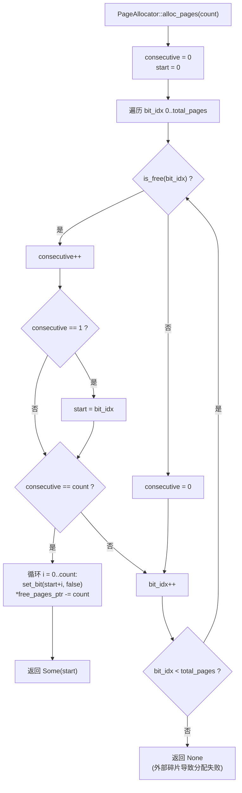

#### 等待式分配 (`alloc_pages_wait`)

当当前无足够连续空闲页时，`alloc_pages_wait` 通过 unlock → sleep(10ms) → lock → retry
循环等待，直到分配成功。调用方必须在持有页互斥锁时调用此方法；等待期间锁被临时释放，
允许其他进程分配或释放页。

此方法用于两种场景：
- **客户端上传**：等待共享内存有足够空间写入数据
- **服务端 GET 响应**：等待共享内存有足够空间返回数据

### 3.3 跨进程页分配同步

页分配位图位于共享内存中，服务端和多个客户端可能同时访问。为保证分配/释放的原子性，
使用位于控制页中的 `pthread_mutex_t`（`PTHREAD_PROCESS_SHARED` 属性）进行跨进程互斥。

**锁的获取模式**：

| 操作 | 客户端 | 服务端 |
|------|--------|--------|
| PUT (小文件) | lock → alloc → write → unlock → socket_cmd | lock(state) → lock(page) → read → free → unlock(page) → store.put |
| PUT (分块) | lock → alloc → write → unlock → socket_cmd (每块) | lock(state) → lock(page) → read → free → unlock(page) → 追加缓冲区 |
| GET | socket_cmd → lock → read → free → unlock | lock(state) → lock(page) → alloc → write → unlock(page) |

**关键设计：客户端在发送 socket 命令前释放锁。**

客户端不在持有页锁期间等待服务端响应，避免死锁。
服务端处理请求时先获取 `ServerState` 锁（`Arc<Mutex<>>`），
再获取页锁——两把锁始终按相同顺序获取：

```
ServerState 锁 (内部锁) → 页互斥锁 (外部锁)
```

客户端只持有页锁，不持有 `ServerState` 锁，因此不会发生锁序反转。

**PUT 操作生命周期**：
1. 客户端：lock → alloc → write → unlock → 发送 socket 命令
2. 服务端：收到命令 → lock(state) → lock(page) → read → free → unlock(page) → store.put → unlock(state)
3. 页由服务端释放，客户端不重复释放（避免并发竞态）

**GET 操作生命周期**：
1. 客户端：发送 socket 命令，收到响应
2. 服务端：lock(state) → 查缓存/store → lock(page) → alloc → write → unlock(page) → unlock(state) → 返回页号
3. 客户端：lock → read → free → unlock（客户端释放页）

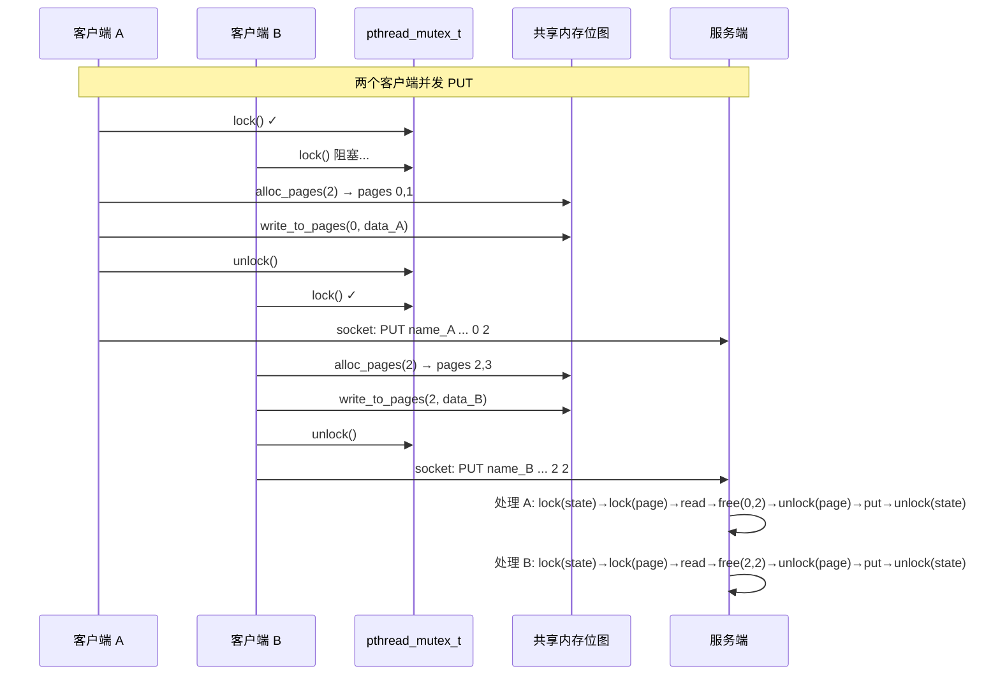

### 3.4 请求/响应队列 — 基于信号量的有界缓冲区

共享内存中实现了一个基于 **4 个 POSIX 命名信号量 + 2 个跨进程互斥锁** 的请求/响应
环形缓冲区（有界缓冲区），用于替代 Unix Socket 传输命令文本。这是操作系统教材中
经典的 **生产者-消费者问题（Producer-Consumer Problem）** 的完整实现。

**队列在控制页中的布局**：

```
Page 0 (4096 B):
  ShmControlHeader (28 B)
  Page Bitmap       (变化)
  page_mutex        (pthread_mutex_t, ~40-64 B)
  ── 队列区（紧接 page_mutex 后）──
  ShmQueueHeader    (32 B)  magic="MOSQ", num_slots, head/tail 索引
  req_mutex         (pthread_mutex_t, ~40-64 B)
  resp_mutex        (pthread_mutex_t, ~40-64 B)
  QueueRequest[0..N-1]   (N × 256 B, 命令槽位)
  QueueResponse[0..N-1]  (N × 256 B, 响应槽位)
```

**信号量语义**：

| 信号量 | 初值 | 语义 | P(wait) | V(post) |
|--------|------|------|---------|---------|
| `{shm}_req_empty` | N | 请求队列空闲槽位数 | 客户端（发送前） | 服务端（取出后） |
| `{shm}_req_full` | 0 | 请求队列就绪槽位数 | 服务端（取出前） | 客户端（发送后） |
| `{shm}_resp_empty` | N | 响应队列空闲槽位数 | 服务端（发送前） | 客户端（取出后） |
| `{shm}_resp_full` | 0 | 响应队列就绪槽位数 | 客户端（取出前） | 服务端（发送后） |

这 4 个信号量精确对应 Dijkstra (1965) 论文中描述的有界缓冲区同步模式。
每个信号量有明确的语义：`empty` 计数可用的"空资源"，`full` 计数可消费的"满资源"。

**队列操作流程（以客户端 PUT 为例）**：

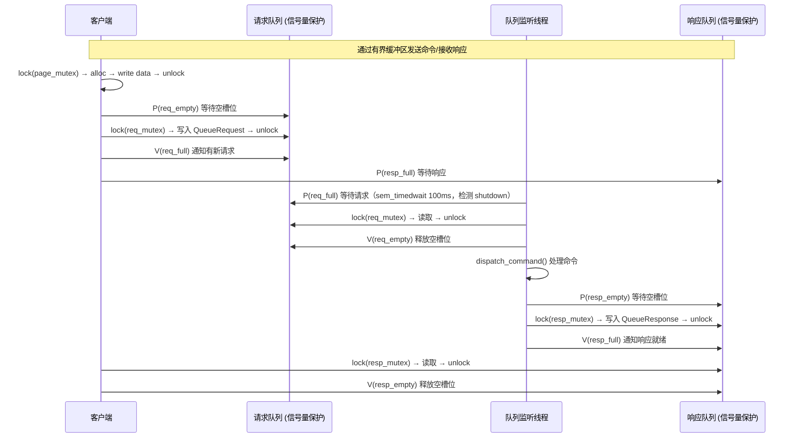

**关于 FIFO 顺序**：队列监听线程是**单线程**，按请求到达顺序（`req_full` 信号量的 FIFO 唤醒语义）
逐一处理。因此响应也按相同顺序输出，客户端不需要在响应中匹配 `client_id`——虽然
`QueueResponse` 包含 `client_id` 字段以备将来扩展。

**与 Socket 路径的关系**：共享内存队列与 Unix Socket 并行运行。客户端自动检测队列
可用性（通过 `ShmQueueHeader` 魔数 "MOSQ"），若队列不可用则回退到 Socket。
服务端通过 `--shm-queue-slots` 参数控制队列启用（设为 0 则禁用，完全走 Socket）。

**关闭流程**：主线程在关闭时设置 `shutdown` 标志并调用 `wake_all()`（向 4 个信号量
各 post 一次），使阻塞在 `sem_wait`/`sem_timedwait` 上的队列监听线程被唤醒并退出。

---

## 4. LRU 缓存

### 4.1 数据结构

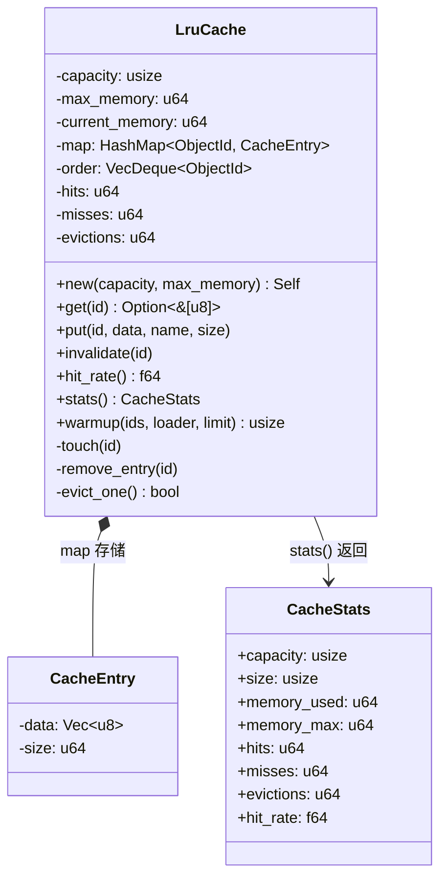

### 4.2 淘汰流程

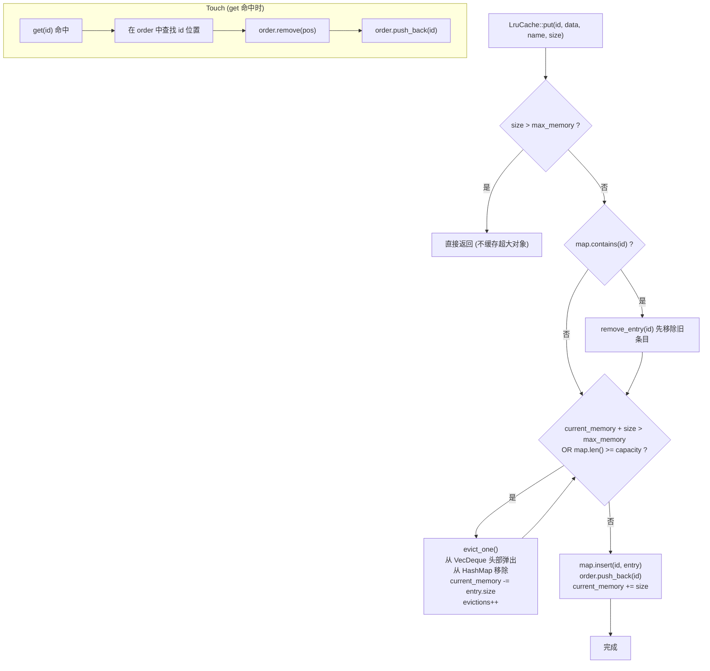

### 4.3 缓存预热

服务端启动时自动执行缓存预热：遍历存储中的所有活跃对象，将其数据加载到 LRU 缓存中，
最多加载 `cache_capacity` 个对象。预热可减少首次访问时的 I/O 开销。

---

## 5. 通信协议

系统采用 **双通道** 架构：

- **控制通道**：Unix Domain Socket，文本协议，每次请求一个连接
- **数据通道**：POSIX 共享内存 (`shm_open`/`mmap`)，传输对象数据

### 5.1 命令格式

所有命令以 `\n` 结尾，服务端返回以 `\n` 结尾的文本响应。

**基础命令**：

| 命令 | 格式 | 响应 | 说明 |
|------|------|------|------|
| `PUT` | `PUT <name> <size> <content_type> <tags> <start_page> <num_pages>\n` | `OK <uuid>\n` | 小文件单次上传 |
| `GET` | `GET <uuid_or_name>\n` | `OK <size> <start_page> <num_pages>\n` | 下载对象 |
| `DELETE` | `DELETE <uuid>\n` | `OK deleted\n` | 删除对象 |
| `LIST` | `LIST\n` | `OK <count>\n` + 每行一个对象 | 列出所有对象 |
| `STATUS` | `STATUS\n` | `OK\n` + 多行统计信息 | 查看服务端状态 |
| `STOP` | `STOP\n` | `OK shutting down\n` | 停止服务端 |

**错误响应**：以 `ERROR` 开头，后跟描述信息。

当前实现为了保持课程设计演示简单，控制通道采用空格分隔的文本协议；对象名、`content_type`
和 `tags` 不应包含空格，客户端会将 `tags` 中的空格替换为 `_`。`protocol/request.rs` 和
`protocol/response.rs` 中保留了共享内存请求/响应槽位结构（`ShmRequest` 256 bytes、
`ShmResponse` 256 bytes），作为后续改为纯共享内存队列协议时的扩展基础；当前主流程以
Unix Domain Socket 文本控制消息为准。

### 5.2 分块上传协议

大文件（超过共享内存容量）通过三步协议分块上传：

| 步骤 | 命令 | 说明 |
|------|------|------|
| 1. 开始 | `PUT_BEGIN <name> <total_size> <content_type> <tags>\n` | 服务端创建上传缓冲区 (`PendingUpload`) |
| 2. 循环 | `PUT_CHUNK <name> <chunk_size> <start_page> <num_pages>\n` | 服务端从共享内存读取块，追加到缓冲区，释放页 |
| 3. 结束 | `PUT_END <name>\n` | 服务端将完整数据写入 `store.odb`，清理缓冲区 |

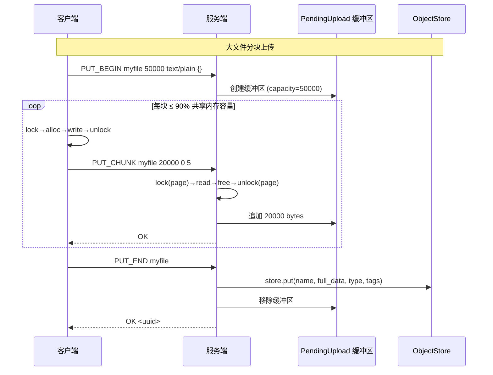

**设计要点**：
- 每块最多使用 90% 的共享内存页，保留少量页避免碎片导致的分配失败
- 正常路径：页由服务端在 `PUT_CHUNK` 中释放，客户端不重复释放
- 错误路径：服务端返回 ERROR 时未释放页，客户端需自行清理
- `PUT_END` 之后数据才真正持久化到 `store.odb`

### 5.3 通信模式

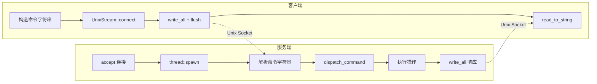

服务端采用 **每连接一线程** 模型：`UnixListener` 设为非阻塞模式，
主循环以 50ms 间隔轮询 `accept()`，每次 accept 成功后 `thread::spawn` 处理。
这种模型足够简单，适合课程设计场景。

### 5.4 连接数限制

服务端通过 `AtomicU32` 维护活跃客户端计数。当活跃连接数达到 `max_clients`（默认 16）时，
新连接被拒绝，服务端返回 `ERROR server busy` 后立即关闭连接。
每个工作线程结束时递减计数器。

### 5.5 客户端模式

客户端支持以下运行模式：

| 命令 | 说明 |
|------|------|
| `minios put <file> [--name] [--content-type] [--tags]` | 上传文件（自动判断单次/分块传输） |
| `minios get <uuid_or_name> [-o <path>]` | 下载对象（默认输出到 stdout） |
| `minios delete <uuid>` | 删除对象 |
| `minios list` | 列出所有对象 |
| `minios status` | 查看服务端状态（存储、缓存、共享内存统计） |
| `minios start [--server <path>] [--daemon]` | 启动服务端进程（可指定二进制路径、是否守护进程化） |
| `minios stop` | 停止服务端（发送 STOP 命令） |

`minios start` 非 daemon 模式时会将服务端 stdout/stderr 重定向到日志文件；
daemon 模式下服务端自行 double-fork 并写入 PID 文件。

### 5.6 多生产者-多消费者工作模型

服务端采用 **MPMC（Multi-Producer Multi-Consumer）** 模型处理客户端请求。
使用 `crossbeam::channel`（有界通道）实现真正的多生产者-多消费者并发：

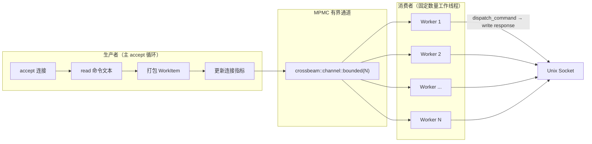

**关键设计**：

| 组件 | 类型 | 说明 |
|------|------|------|
| 工作队列 | `crossbeam::channel::bounded(WorkItem)` | 有界 MPMC 通道，容量 = max_clients × 2 |
| 生产者 | 主 accept 循环 | 读取命令后通过 `try_send()` 非阻塞推入队列 |
| 消费者 | 固定数量工作线程 | 从队列拉取 `WorkItem`，处理后写回 socket |
| 工作项 | `WorkItem` 枚举 | 包含 `Command { stream, command }` 和 `Shutdown` 两种变体 |
| 连接数限制 | `AtomicU32` CAS | 生产者推入前检查，消费者完成时递减 |
| 背压 | `try_send` 满时返回 `Full` 错误 | 拒绝新连接，返回 `ERROR server busy` |
| 优雅关闭 | `WorkItem::Shutdown` | 向每个工作线程发送一个关闭令牌，然后 join |

**与旧模型的对比**：

| 方面 | 旧模型（每连接一线程） | 新模型（MPMC 线程池） |
|------|----------------------|----------------------|
| 线程数量 | 无上限（受 max_clients 限制） | 固定（`--worker-threads`，默认 4） |
| 线程创建/销毁 | 每个请求一次 spawn/kill | 线程常驻，启动时创建、关闭时退出 |
| 工作调度 | OS 直接调度 spawn 的线程 | 通过 bounded channel 显式排队 |
| 生产者-消费者 | 无显式分离 | 明确的生产者（accept）和消费者（workers） |
| 请求隔离 | 完全隔离（每个线程独立） | 工作线程间共享 State |

**工作线程生命周期**：

1. 启动时创建 N 个工作线程，每个绑定 `Receiver` 和 `Arc<ServerState>`
2. 工作线程循环 `rx.recv()`
3. 收到 `Command` → `dispatch_command()` → `stream.write_all()` → 递减 `active_clients`
4. 收到 `Shutdown` → 退出循环
5. 通道关闭 → 退出循环

**WorkItem 定义**（`minios-server/src/main.rs`）：

```rust
enum WorkItem {
    Command {
        stream: UnixStream,
        command: String,
    },
    Shutdown,
}
```

**启动选项**：

```bash
# 默认 4 个工作线程
minios-server --store-path ./store.odb &

# 自定义工作线程数
minios-server --store-path ./store.odb --worker-threads 8 &
```

---

## 6. 守护进程管理

### 6.1 Double-Fork 流程

服务端通过经典的 double-fork 技术转为守护进程：

1. `fork()` → 父进程退出
2. 子进程 `setsid()` → 成为新会话领导，脱离控制终端
3. 再次 `fork()` → 第一个子进程退出（确保进程非会话领导，无法重新获取终端）
4. `chdir("/")` → 避免占用挂载点
5. `umask(0o022)` → 设置默认文件权限
6. 关闭 stdin/stdout/stderr，重定向到 `/dev/null`

### 6.2 信号处理

| 信号 | 行为 |
|------|------|
| `SIGTERM` | 设置 `SHUTDOWN_FLAG = true`，主循环检测到后进入优雅关闭 |
| `SIGINT` | 同上 |
| `SIGPIPE` | 忽略（防止向已关闭 socket 写入时进程崩溃） |

### 6.3 PID 文件管理

- `write_pidfile(path)`: 将当前进程 PID 写入文件
- `read_pidfile(path)`: 从文件读取 PID
- `remove_pidfile(path)`: 清理 PID 文件
- `send_signal(pid, signal)`: 通过 `kill()` 向指定进程发送信号

### 6.4 优雅关闭流程

服务端收到 STOP 命令或 SIGTERM/SIGINT 信号后：

1. 设置 `SHUTDOWN_FLAG`
2. 主循环退出
3. `drop(listener)` 关闭 socket，停止接受新连接
4. `sleep(200ms)` 等待活跃工作线程完成
5. 尝试 `Arc::try_unwrap(state)` 获取独占所有权：
   - 成功：flush store → destroy shared memory → 清理 socket 和 pidfile
   - 失败（仍有线程持有引用）：通过 `lock()` 强制 flush store（共享内存由内核在进程退出后自动回收）
6. 进程退出

---

## 7. 错误处理与日志

### 7.1 错误类型 (`MiniosError`)

使用 `thiserror` crate 定义的错误枚举，覆盖所有子系统：

| 变体 | 说明 |
|------|------|
| `Io(std::io::Error)` | 文件 I/O 错误 |
| `InvalidStore(String)` | 存储文件格式无效（魔数、版本、校验和不匹配） |
| `ObjectNotFound(String)` | 对象未找到 |
| `NoSpace(String)` | 存储空间或元数据槽位不足 |
| `ShmError(String)` | 共享内存操作错误 |
| `IpcError(String)` | 进程间通信错误 |
| `CacheError(String)` | 缓存错误 |
| `ProtocolError(String)` | 协议解析错误 |
| `InvalidUuid(String)` | UUID 格式无效 |
| `DaemonError(String)` | 守护进程操作错误 |
| `StringError(std::str::Utf8Error)` | 字符串编码错误 |

### 7.2 日志系统

服务端使用 `env_logger` + `log` crate 进行分级日志输出：
- `log::info!`: 启动、对象操作、缓存预热等关键事件
- `log::warn!`: 缓存加载失败、连接拒绝等非致命问题
- `log::error!`: 致命错误，通常导致进程退出

日志级别通过 `RUST_LOG` 环境变量控制（默认 `info`）。

---

## 8. Prometheus 监控接口

### 8.1 概述

服务端内置了一个极简 HTTP 服务端，在独立的线程中运行，以 Prometheus 标准文本格式
暴露运行指标。该功能通过 `--metrics-port` 参数控制（默认端口 9090，设为 0 则禁用）。

### 8.2 指标端点

| 端点 | 方法 | 说明 |
|------|------|------|
| `/metrics` | GET | 返回 Prometheus text exposition 格式的运行指标 |
| 其他路径 | GET | 返回 HTTP 404 |

可通过 `curl http://localhost:9090/metrics` 直接查看当前指标，也可配置 Prometheus
或 Grafana 抓取此端点进行可视化监控。

### 8.3 指标清单

#### 连接级指标

| 指标名 | 类型 | 说明 |
|--------|------|------|
| `minios_uptime_seconds` | Gauge | 服务端运行时长（秒） |
| `minios_active_connections` | Gauge | 当前活跃客户端连接数 |
| `minios_connections_total` | Counter | 累计接受的连接数 |
| `minios_requests_total` | Counter | 累计处理的请求数 |

#### 存储引擎指标

| 指标名 | 类型 | 说明 |
|--------|------|------|
| `minios_store_objects` | Gauge | 当前存储的对象总数 |
| `minios_store_blocks_free` | Gauge | 空闲数据块数 |
| `minios_store_blocks_total` | Gauge | 数据块总数 |
| `minios_store_file_size_bytes` | Gauge | 存储文件大小（字节） |

#### 缓存指标

| 指标名 | 类型 | 说明 |
|--------|------|------|
| `minios_cache_entries` | Gauge | 当前缓存条目数 |
| `minios_cache_hits_total` | Counter | 缓存命中次数 |
| `minios_cache_misses_total` | Counter | 缓存未命中次数 |
| `minios_cache_evictions_total` | Counter | 缓存淘汰次数 |

#### 共享内存指标

| 指标名 | 类型 | 说明 |
|--------|------|------|
| `minios_shm_pages_free` | Gauge | 共享内存空闲页数 |
| `minios_shm_pages_total` | Gauge | 共享内存总页数 |

### 8.4 实现架构

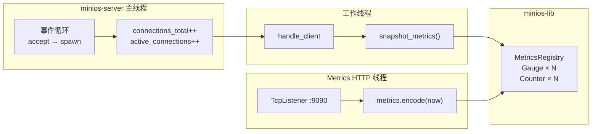

每次请求处理完成后，`snapshot_metrics()` 从 `ServerState` 中读取存储、缓存和共享内存
的最新统计信息，同步写入 `MetricsRegistry` 中的 Gauge。Counter 类型指标（连接数、
请求数）由 accept 和 dispatch 回调直接 inc。

`/metrics` 端点查询时，HTTP 线程对 `ServerState` 加锁，调用 `metrics.encode(now)`
将当前所有注册指标序列化为 Prometheus 文本格式返回。锁持有时间仅为一个 encode 调用，
不影响请求处理。

### 8.5 启动选项

```bash
# 默认端口 9090
minios-server --store-path ./store.odb &

# 自定义端口
minios-server --store-path ./store.odb --metrics-port 9876 &

# 禁用 metrics 端点
minios-server --store-path ./store.odb --metrics-port 0 &
```

### 8.6 示例输出

```
# HELP minios_uptime_seconds Server uptime in seconds
# TYPE minios_uptime_seconds gauge
minios_uptime_seconds 123.00
# HELP minios_active_connections Current number of active client connections
# TYPE minios_active_connections gauge
minios_active_connections 2
# HELP minios_connections_total Total number of accepted connections
# TYPE minios_connections_total counter
minios_connections_total 15
# HELP minios_requests_total Total number of processed requests
# TYPE minios_requests_total counter
minios_requests_total 15
# HELP minios_store_objects Current number of stored objects
# TYPE minios_store_objects gauge
minios_store_objects 42
# HELP minios_store_blocks_free Number of free data blocks
# TYPE minios_store_blocks_free gauge
minios_store_blocks_free 3952
# HELP minios_store_blocks_total Total number of data blocks
# TYPE minios_store_blocks_total gauge
minios_store_blocks_total 4096
# HELP minios_store_file_size_bytes Store file size in bytes
# TYPE minios_store_file_size_bytes gauge
minios_store_file_size_bytes 16814080
# HELP minios_cache_entries Current number of cache entries
# TYPE minios_cache_entries gauge
minios_cache_entries 42
# HELP minios_cache_hits_total Total number of cache hits
# TYPE minios_cache_hits_total counter
minios_cache_hits_total 23
# HELP minios_cache_misses_total Total number of cache misses
# TYPE minios_cache_misses_total counter
minios_cache_misses_total 5
# HELP minios_cache_evictions_total Total number of cache evictions
# TYPE minios_cache_evictions_total counter
minios_cache_evictions_total 0
# HELP minios_shm_pages_free Number of free shared memory pages
# TYPE minios_shm_pages_free gauge
minios_shm_pages_free 250
# HELP minios_shm_pages_total Total number of shared memory pages
# TYPE minios_shm_pages_total gauge
minios_shm_pages_total 256
```

---

## 9. 模块组织

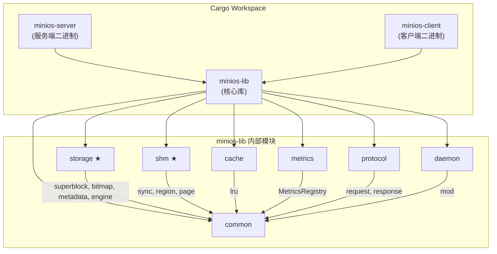

### 9.1 依赖关系

| crate | 主要依赖 |
|-------|----------|
| `minios-lib` | `uuid` (v4), `thiserror`, `log`, `libc`, `prometheus` |
| `minios-server` | `minios-lib`, `clap` (derive), `crossbeam`, `log`, `env_logger`, `libc` |
| `minios-client` | `minios-lib`, `clap` (derive), `libc` |

---

## 10. 服务端内部状态管理

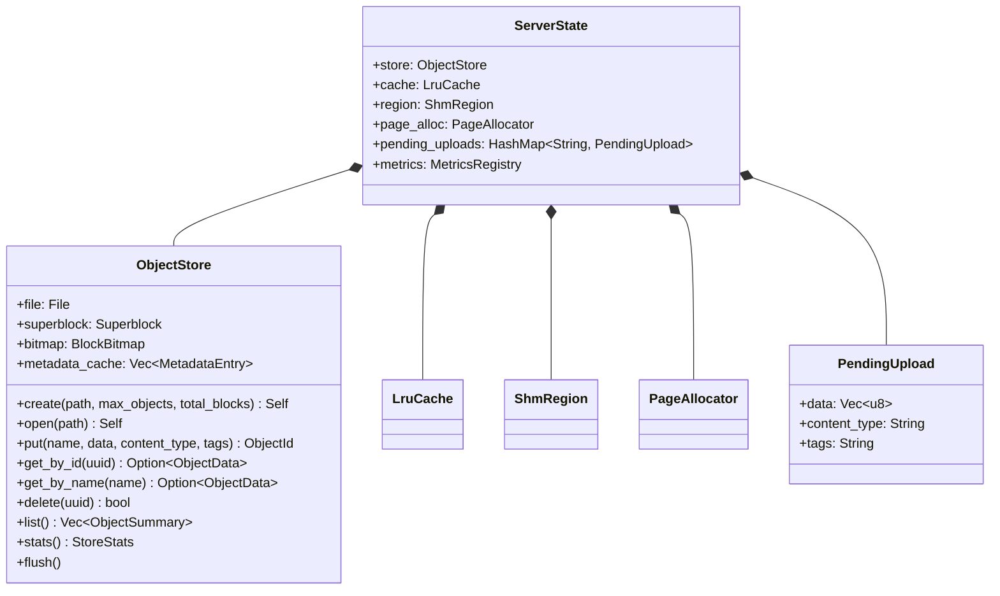

`ServerState` 由 `Arc<Mutex<ServerState>>` 包裹，所有工作线程共享同一份状态。
每个请求处理期间持有锁，保证操作原子性。

工作线程池通过 `crossbeam::channel` 实现多生产者-多消费者调度（详见 5.6 节）。

---

## 11. 测试策略

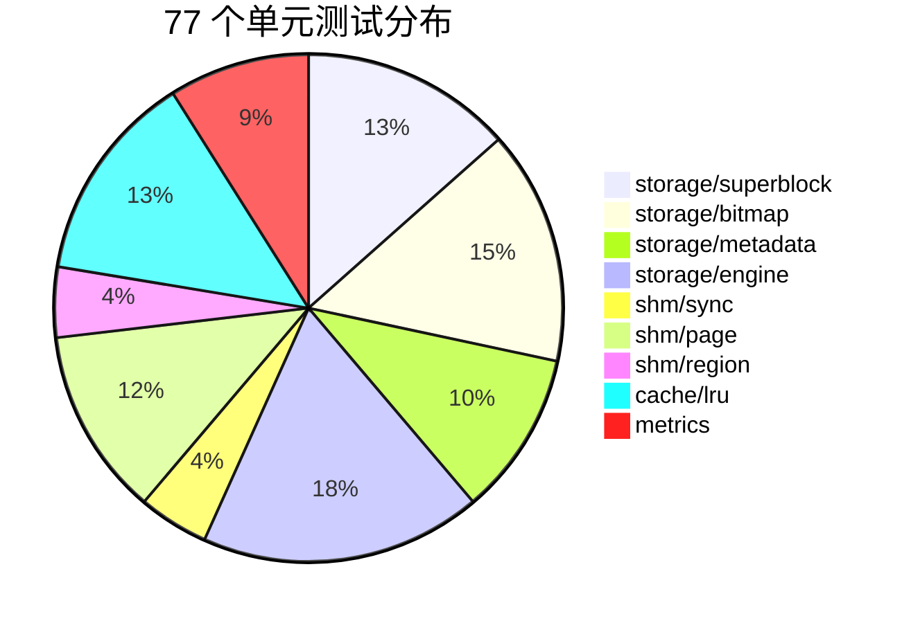

| 模块 | 测试数 | 覆盖要点 |
|------|--------|----------|
| superblock | 9 | 创建、序列化往返、魔数/版本校验、文件读写、时间戳、文件大小计算 |
| bitmap | 10 | 单块分配、多块分配、耗尽、释放、幂等释放、序列化往返、非对齐块数 |
| metadata | 7 | 空闲条目、活跃条目、校验和、序列化往返、中文名、名称截断 |
| engine | 12 | 创建/打开、Put/Get/Delete/List、大对象跨块、空对象、持久化往返、统计、元数据校验和损坏检测 |
| shm/sync | 3 | 互斥锁加解锁、命名信号量 wait/post、try_wait |
| shm/page | 8 | 单页分配、多页连续、耗尽、碎片检测、碎片率计算、零页边界、超限边界 |
| shm/region | 3 | 创建/销毁、写入/读取、打开已存在区域 |
| cache/lru | 9 | 存/取、未命中、命中率、条目淘汰、内存淘汰、LRU 顺序、失效、预热、超大对象跳过 |
| metrics | 6 | 注册表创建、Counter 递增、Gauge 设置、uptime 计算、encode 输出格式、空指标编码 |

注：`shm/region` 的 3 个测试仅在 Linux 目标上启用（`#[cfg(target_os = "linux")]`）；
在 macOS 本机运行时通常显示 58 个测试通过。

### 10.1 手动并发测试注意事项

服务端在集成测试中通常以 `./target/release/minios-server ... &` 的形式作为当前
shell 的后台任务运行。编写并发上传测试时，需要记录每个测试子进程的 PID，并逐个
`wait "$pid"`；不能直接使用无参数 `wait`，否则 shell 会同时等待仍在运行的
`minios-server`，造成测试脚本看起来卡住。

该现象属于测试脚本等待范围错误，不是共享内存页锁或服务端请求处理线程死锁。客户端
并发 `put` 返回 `OK <uuid>` 后已经完成上传，后续阻塞发生在 shell 等待后台任务阶段。
