# Minios 对象存储服务 — 设计文档

## 1. 系统概述

MiniOS（Mini Object Storage）是一个简单的对象存储服务，采用扁平化命名空间管理数据，
所有对象持久化到单一复合文档文件 `store.odb` 中。系统由服务端守护进程和命令行客户端组成，
通过 Unix Domain Socket + POSIX 共享内存双通道进行进程间通信。

### 1.1 系统架构

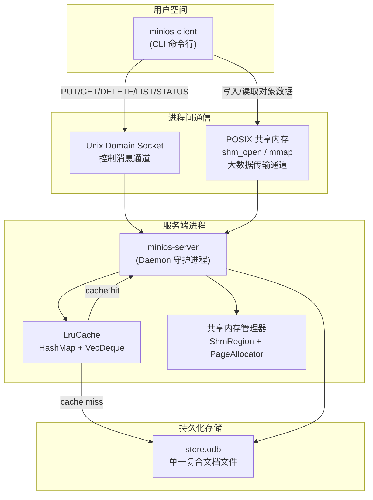

### 1.2 请求处理流程

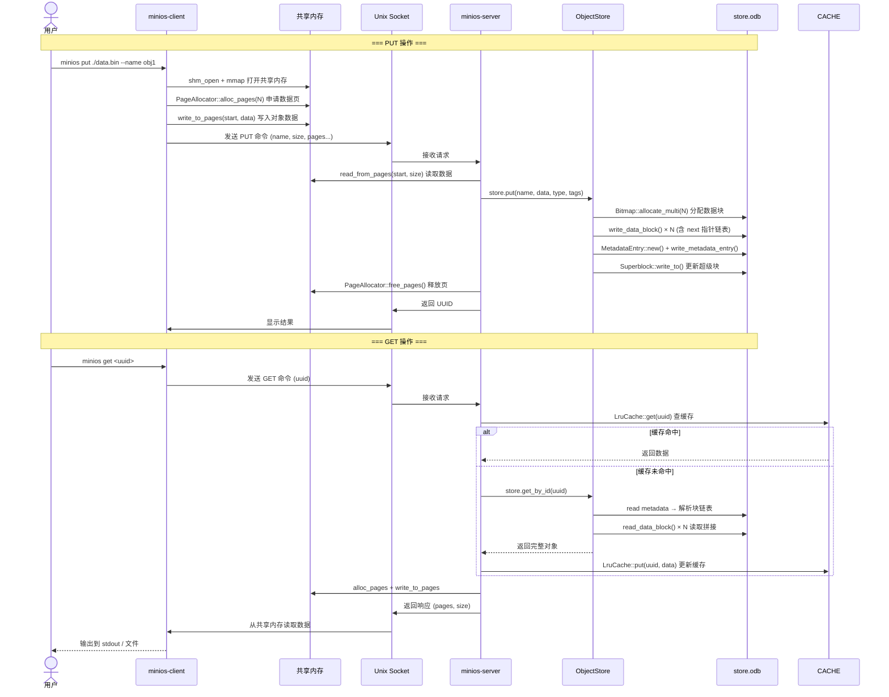

### 1.3 模块依赖关系

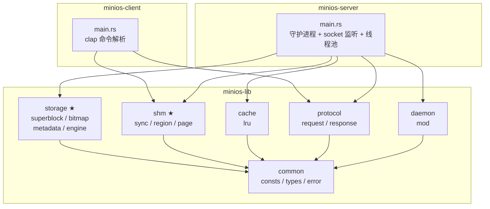

---

## 2. store.odb 文件格式

### 2.1 整体布局

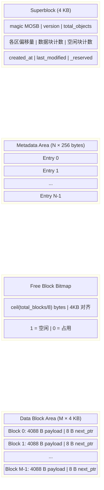

### 2.2 元数据条目布局（256 bytes）

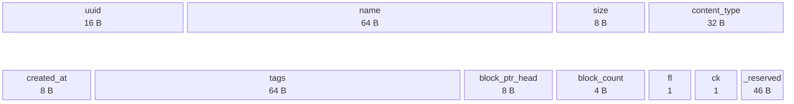

### 2.3 数据块链表结构

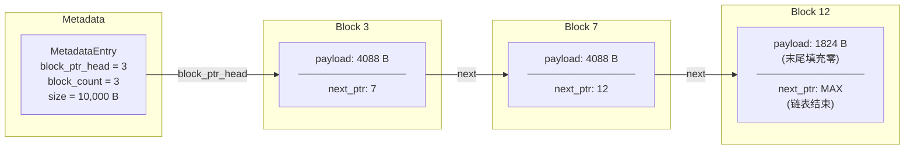

### 2.4 位图分配算法

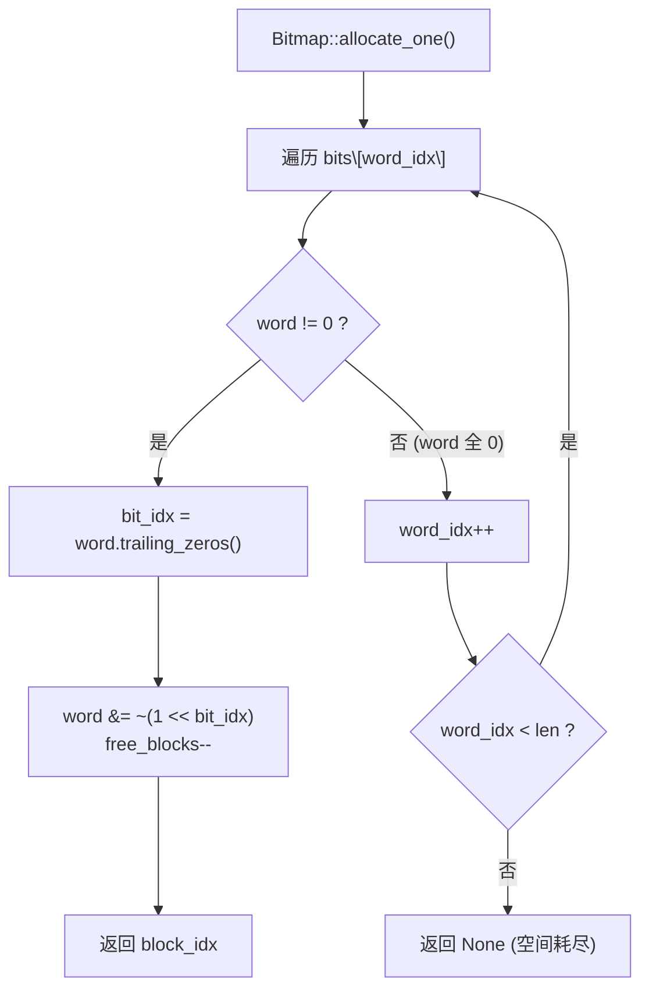

---

## 3. 共享内存缓冲区管理

### 3.1 区域布局

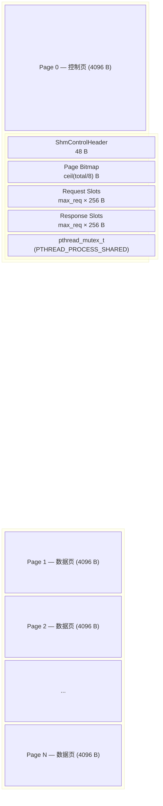

### 3.2 页分配 First-Fit 算法

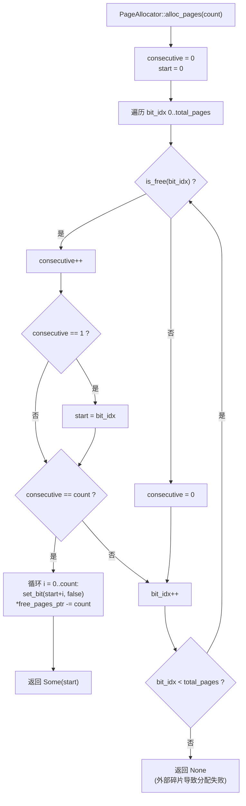

### 3.3 客户端-服务端同步机制

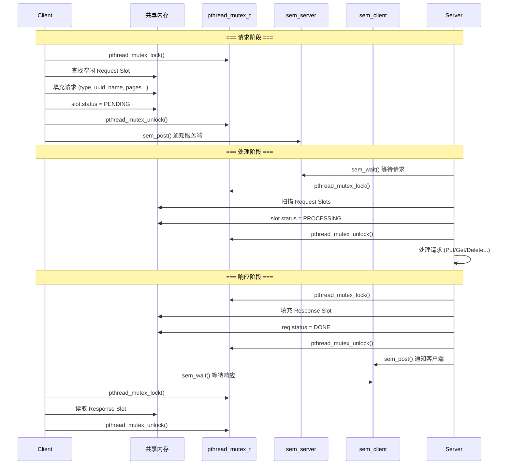

---

## 4. LRU 缓存

### 4.1 数据结构

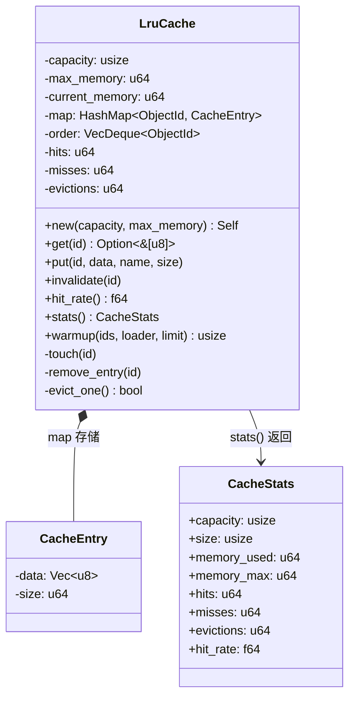

### 4.2 淘汰流程

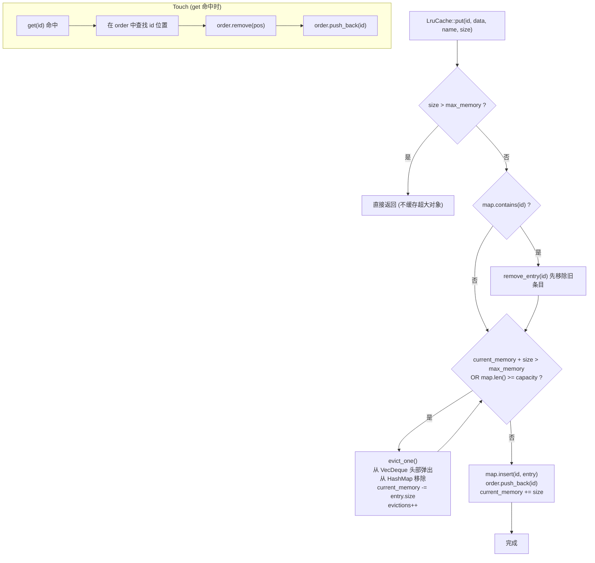

---

## 5. 通信协议

### 5.1 消息类型

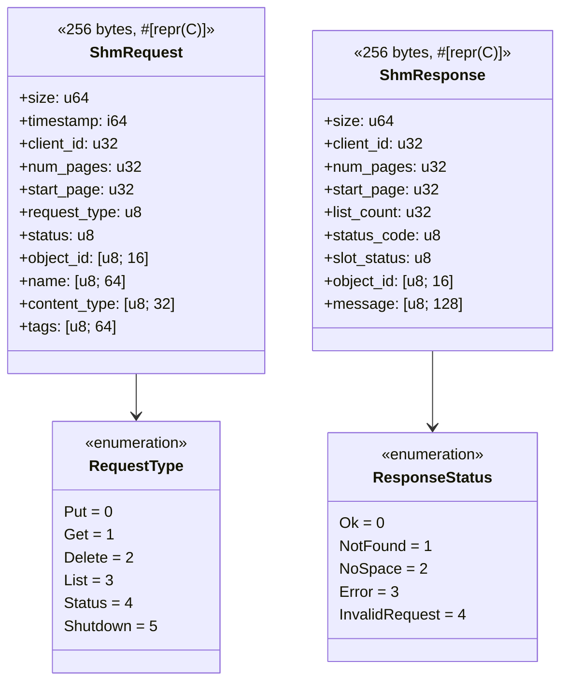

### 5.2 槽位状态机

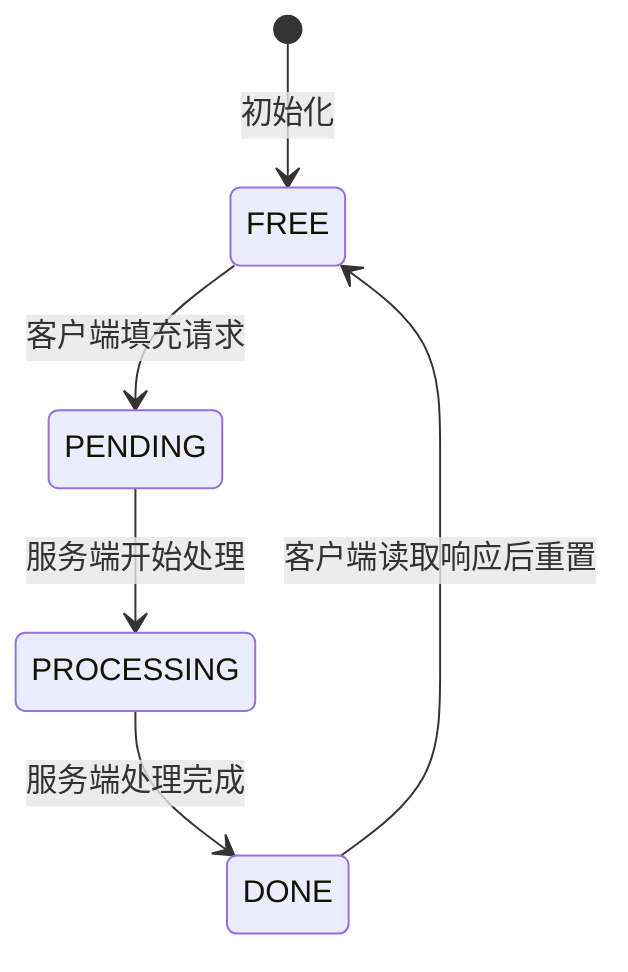

---

## 6. 模块组织

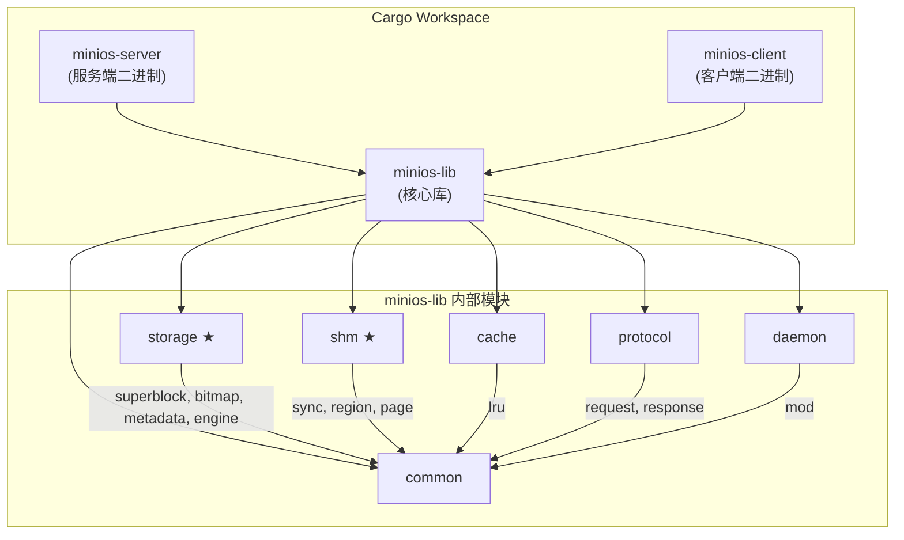

---

## 7. 测试策略

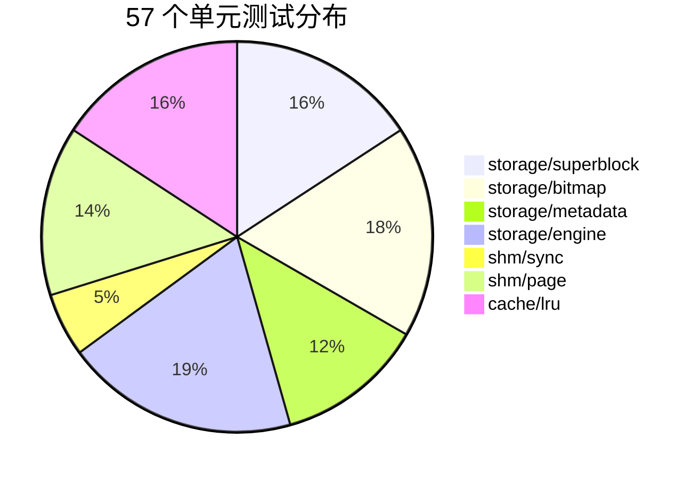

| 模块 | 测试数 | 覆盖要点 |
|------|--------|----------|
| superblock | 9 | 创建、序列化往返、魔数/版本校验、文件读写、时间戳 |
| bitmap | 10 | 单块分配、多块分配、耗尽、释放、幂等释放、序列化 |
| metadata | 7 | 空闲条目、活跃条目、校验和、序列化、中文名、截断 |
| engine | 11 | 创建/打开、Put/Get/Delete/List、大对象跨块、持久化、统计 |
| shm/sync | 3 | 互斥锁加解锁、信号量 wait/post、try_wait |
| shm/page | 8 | 单页分配、多页连续、耗尽、碎片、碎片率、边界 |
| cache/lru | 9 | 存/取、未命中、命中率、条目淘汰、内存淘汰、LRU 顺序、失效、预热 |

### 7.1 手动并发测试注意事项

服务端在集成测试中通常以 `./target/release/minios-server ... &` 的形式作为当前
shell 的后台任务运行。编写并发上传测试时，需要记录每个测试子进程的 PID，并逐个
`wait "$pid"`；不能直接使用无参数 `wait`，否则 shell 会同时等待仍在运行的
`minios-server`，造成测试脚本看起来卡住。

该现象属于测试脚本等待范围错误，不是共享内存页锁或服务端请求处理线程死锁。客户端
并发 `put` 返回 `OK <uuid>` 后已经完成上传，后续阻塞发生在 shell 等待后台任务阶段。
